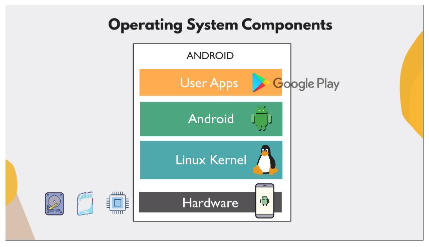

# Intro to Operating Systems

Every computer is made up of hardware resources:

- CPU
- Memory
- Storage (HDD/SSD)
- I/O devices (keyboard, mouse etc.)

**How to interact with these hardware as a "user" (human or application)?**

The applications themselves **don't know** how to interact with these hardware
parts! Instead, all applications use an **intermediary**, the OS to interact
with the hardware resources.

An **operating system**:

- Allocates and manages hardware resources:

  1. CPU Process management: 1 CPU can process one process at a time; switches
     processes so fast you don't notice. Multi-CPUs can execute processes in
     parallel

  2. Memory (RAM) Management: Allocates working memory to running applications.

  3. Storage management: Persisting data long-term on the hard drive in a
     structured way

  4. I/O Device management

  5. Security and Networking: Managing users and permissions, assiging ports and
     IP addresses, etc.

## How is an OS Constructed?

1. OS Kernel: the part that loads first when booting up a computer. Responsible
   for managing the hardware components. Handles I/O devices using device
   drivers. The kernel is the layer between the hardware and the applications.

2. OS Application layer: E.g. different Linux distributions like Ubuntu, Mint,
   Debian etc., or server distributions. GUI or command line interface is used
   to interact with kernel.

### Main OSs

- Linux
  - desktop
  - server distros
- Windows
  - desktop
  - server distros
- macOS
  - desktop distros

### Mac OS vs Linux

Command line, file structure is similar; Windows is completely different
