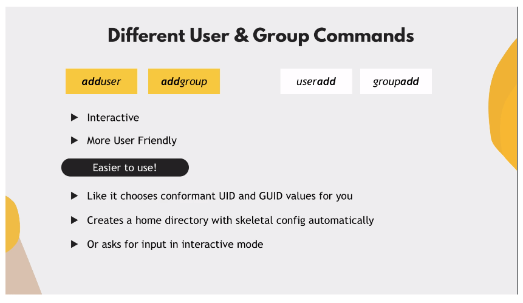

# Linux Accounts & Groups (Users and Permissions): Part 1

## Linux Accounts

There are 3 categories of users on a Linux system:

1. **Root** user (super user): Has **unrestricted** permissions

2. **Standard** users: A regular user account that we create. Each user has a
   dedicated directory in `/home` directory with the same name as user (e.g.
   `/home/tom`).

3. **Service** user: relevant on Linux server distros. Each service will get its
   own user (e.g. `mysql` user will start mysql application).

**Do NOT run services with the root user!**

You may have multiple standard and service users on one machine, but only
**one** root user.

### Multiple Users on Linux

In Linux, users are registered and exist **only on that specific
hardware/machine**.

Usually in the Linux world, having multiple users is important only in the
context of server management (i.e. a team of individuals may be managing a
server). Each team member may be assigned varying permissions.

## Managing Permissions on Linux

- at the **User** level: give permissions directly

- at the **Group** level: define a group, assign permissions to the group, and
  add users to the group appropriately (**preferred**)

## User Management in Practice

### Access Control Files in Linux

The following files contain the access control rules on a Linux system:

- `/etc/passwd`: stores user account information; only root user can modify.
  Entry structure is as follows:
  `USERNAME:PASSWORD:USERID:GROUPID:GECOS:HOMEDIR:SHELL`

  _Note that "x" indicates the encrypted password, stored in `/etc/shadow` file_

- `/etc/shadow`:
- `/etc/group`

## Commands

### Add User

- `sudo adduser <username>`: By default Linux creates a group with the same name
  as the user and assigns this user to that group

### Change User Password

- `sudo passwd <username>`

### Login as a User

- `su - <username>`: `su` = "switch user"
- `su -`: Log in as root user

### Add Group

- `sudo groupadd <groupname>`

### Add a User to a Group

- `sudo usermod -g <groupname> <username>`
- `sudo usermod -G <groupname> <username>`: Add a user to a **new** group and
  delete from all other groups
- `sudo usermod -aG <new-groupname> <username>`: Add a user to a **new** group,
  but maintain the **old** group(s) membership

### Delete a Group

- `sudo delgroup <groupname>`

### Remove a User from a Group

- `sudo gpasswd -d <username> <groupname>`
