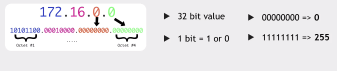
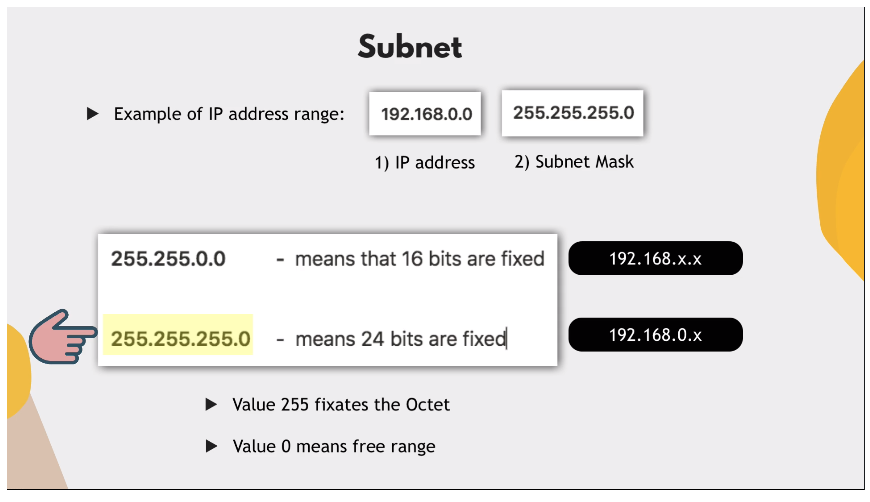

# Networking

## LAN, Switch Router, WAN, Gateway

A **LAN** is a collection of devices connected together in one physical
location. Each device has a unique IP address. Devices communicate via these IP
addresses.

An IP address is composed of 32 bits (1 bit = 1 or 0):



IP addresses can range from `0.0.0.0` to `255.255.255.255`.

A **Switch** sits withing the LAN, and facilitates connection between all the
devices **within** the LAN.

For connection to outside devices, a **Router** is needed. A Router sits between
devices on the LAN, and the WAN. The IP address of the router is called the
**Gateway**.

## Subnets

A **Subnet** (sub-network) is logical sub-division of a network.



Example of IP address range:

| Ip Address  | Subnet Mask   |                                                                   |
| ----------- | ------------- | ----------------------------------------------------------------- |
| 192.168.0.0 | 255.255.255.0 | All IP addresses starting with 192.168.1.x belong to the same LAN |
| 192.168.x.x | 255.255.0.0   | All IP addresses starting with 192.168.x.x belong to the same LAN |

Value 255 fixates the octet, value 0 means **free** range.

A **CIDR Block** is the shorthand way of denoting the IP address range and
subnet mask **together**:

`192.168.0.0/16`: Denotes an IP address range beginnig with `192.168.0.0`, and a
subnet mask of `255.255.0.0` (meaning the first **16 bits** are **fixed** (i.e.
equal to 255))

## NAT (Network Address Translation)

How do we ensure that the IP addresses in our LAN don't overlap with those of
devices in other LANs?

When a device on a LAN sends a request through its router to the public
internet, the router requests on the device's behalf. The device IP address is
not exposed, and the device is not connected to the internet directly. This is
called **NAT**. NAT has two benefits:

- Protection of device IP addresses
- Re-use of limited IP addresses across LANs

## Firewall

A **firewall** is a set of rules that protects devices in your network from
unauthorized networks. Allows you to define:

- which IP address in your network is accessible
- which IP address(es) can access your server
- which port(s) on your server/device are accessible

Every device has a set of **ports**, or doors that allow access to a
server/device. You can define which ports are open, to which IP addresses, using
which protocols.

## DNS (Domain Name Service)

Every computer on a network is uniquely identified by its IP address. Usually
though, when a user visits a web application/web site, the user does not enter
the IP address of the server hosting the site. Humans remember words and names
better than IP addresses. **DNS** maps those names to IP addresses.

DNS divides the names into a hierarchical structure:

```
|-Root Domain (".")
    |-Top level/geographic domains:
        |-.mil
        |-.edu
        |-.com
        |-.gov
        |-.org
        |-.net
        |-.us
        |-.fr
        |-.jp
        |-etc...

```

You can buy a domain name that belongs to one or more of these domains (e.g.
`techworld-with-nana.com`). The **ICANN** manages the domain name spaces and
**authorizes domain name registrars** through which domain names may be
registered and assigned.

Supposing you have three servers that belong under your domain. You can assign
each server its own domain name with a **subdomain**, e.g.
`bootcamp.techworld-with-nana.com`, `courses.techworld-with-nana.com`,
`foo.techworld-with-nana.com`.

## Networking Commands

- `ifconfig`: List information about your network

- `netstat`: displays active internet connections

- `ps aux`: display currently running programs

- `ns lookup {domain-name}` get IP address of domain name

- `ping {domain-name}`: shows you whether a domain name (or IP address) is
  available
