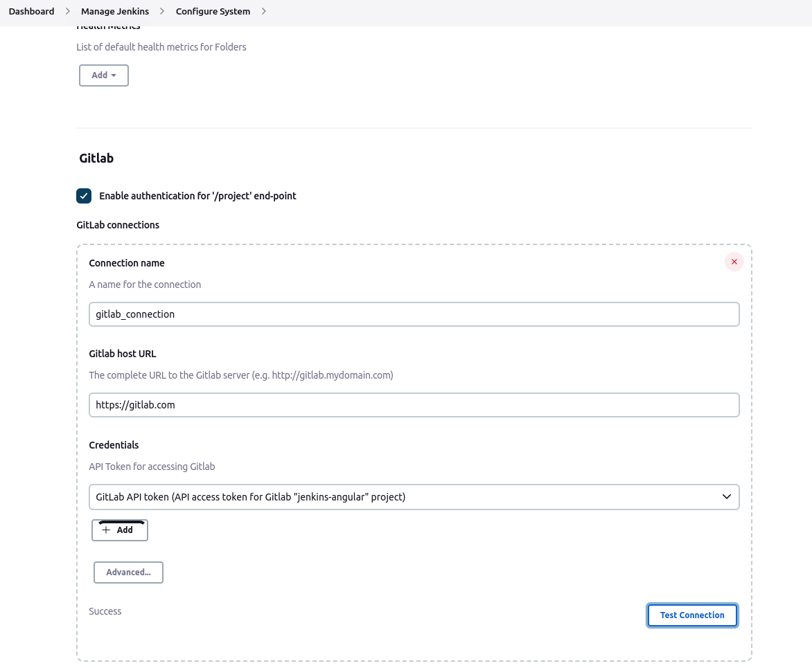
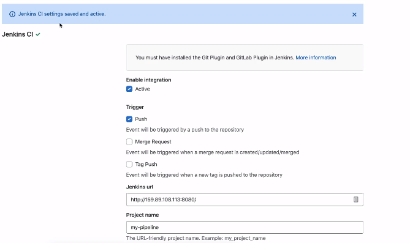

# Automate Jenkins Jobs with Webhooks

We usually want to kick off our pipelines automatically whenever code is pushed
to the SCM repo, instead of manually.

2 steps:

1. Configure Webhook plugin in Jenkins
2. Configure Gitlab to send notifications to Jenkins on commit
3. Configure Jenkinsfile

## Configure Webhook Plugin in Jenkins

1. Dashboard > Manage Plugins > search for "Gitlab" plugin > Install w/o restart
2. Manage Jenkins > configure system > Gitlab
3. Configure parameters:

   - Connection Name: Any arbitrary name for your connection

   - Gitlab Host URL: `https://gitlab.com`

   - Credentials > Add > Gitlab API token

   - Paste token, select token ID and add token

4. Dashboard > {pipeline-name} > Build Triggers

   - Verify that "Build when a change is pushed to Gitlab..." is checked

5. Generate API token in Gitlab:
   - Gitlab > user profile > Access Tokens
   - Add token name, expiration date, permissions ("api" in this case)
   - Save your access token in a secure location; you will not be able to access
     it later

## Configure Gitlab to Send Notifications to Jenkins on Commit

1. Gitlab > Settings > Integrations > Jenkins CI
2. Check boxes for:
   - Enable Integration > Active
   - Trigger > Push
3. Configure Jenkins connection:

   - Jenkins server IP address (with port) **NOTE**: Gitlab does not allow
     localhost connections (if your Jenkins server is running on localhost)

   Jenkins URL - `http://xxx.x.x.x:8080/` Project name - `name-of-jenkins-job`

   - Project Name (should be job name in Jenkins)
   - Username: Jenkins login username
   - Password: Jenkins login password

4. Save changes

## Configure Webhooks for MULTIBRANCH Pipelines (16:22)

1. Manage Plugins > Multibranch Scan Webhook Trigger plugin
2. Dashboard > {multibranch-job} > Scan Multibranch Pipeline Triggers
   - Select "Scan by webhook"
3. Trigger token > add (arbitrary) token name `token-name`

We will tell Gitlab to send Jenkins a notification on a specific URL including
the token. Jenkins will receive the request, check the token, and trigger a
multibranch pipeline that has a "Scan by webhook" configured for **that specific
token**.

**NOTE: You _still_ need to configure username/password credentials in Jenkins
(in the "Branch Sources" section on the job)**, as well as the token (see below)
in the "Scan Multibranch Pipeline Triggers" section!

4. Configure Gitlab:

   - Webhooks:

     - URL: add IP addr and port of Jenkins server and token name in place of
       `token-name`. **Gitlab will send a notification to Jenkins via this URL
       containing the token.** On every such notification, Jenkins will trigger
       the configured build pipeline:

       `http://{jenkins_ip_addr}:{jenkins_port}/multibranch-webhook-trigger/invoke?token={token-name}`

     - Trigger > Push events
     - Add Webhook
