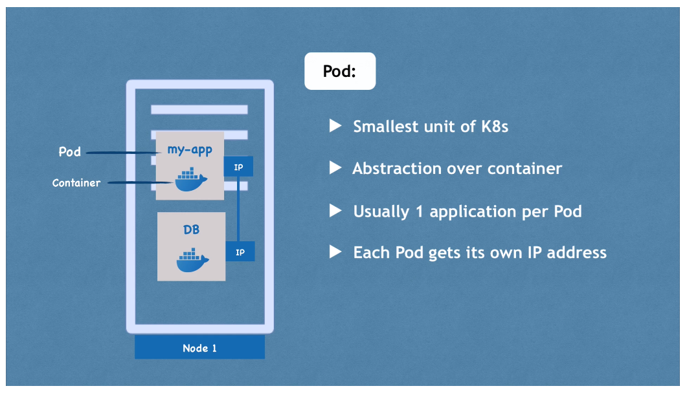
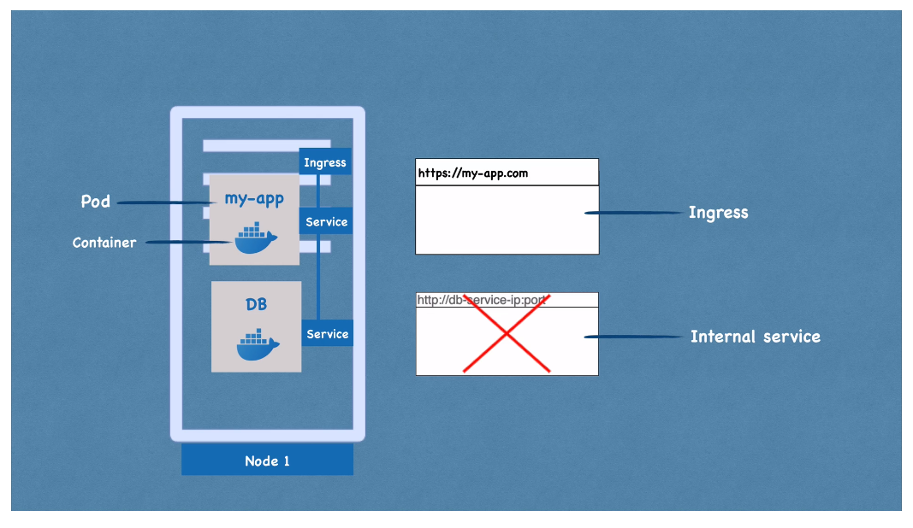
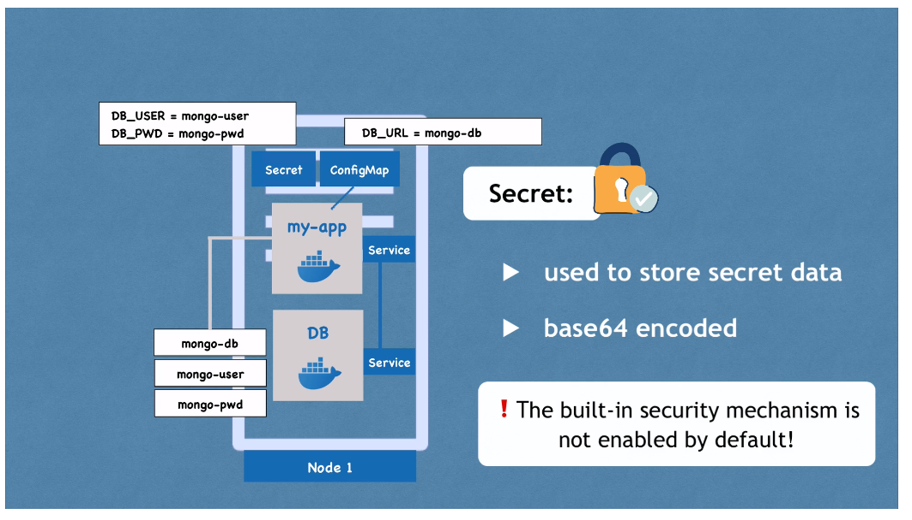
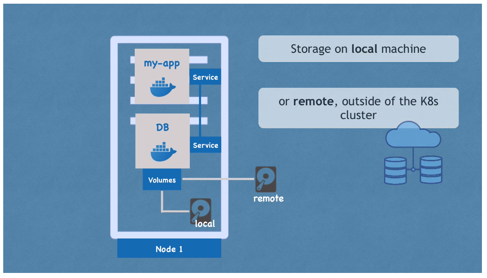
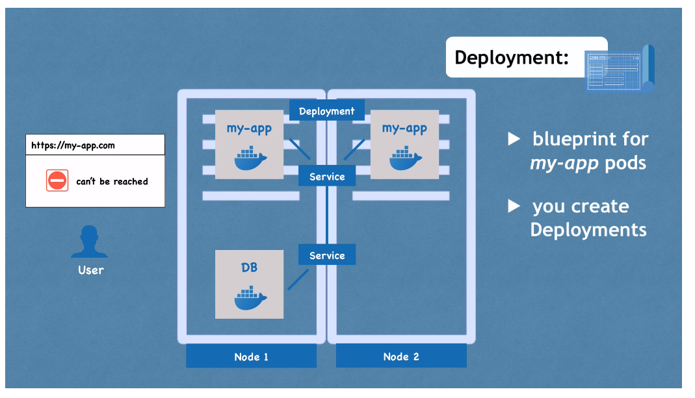
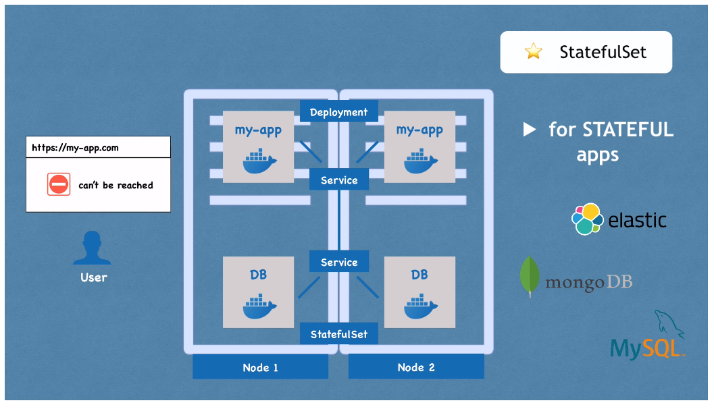

# Main K8s Components

## Node and Pod

A **node** is a physical or virtual server.

A **pod** is a layer of abstraction over a container. It is the smallest unit of
K8s. It is a runtime that abstracts away the actual container technology
(Docker, etc.) runtime. Pods are usually meant to run ONE application in the
container.

Each pod receives its own internal IP address. Pods in a node can communicate
with one another via these internal IP addresses. Pods are **ephemeral**. When a
pod is destroyed, the new pod is assigned a new IP address. Because of this,
**services** are used.

## Services and Ingress

**Services** are static IP addresses that can be attached to each pod.
Lifecycles of pod and service are NOT connected. Also act as load balancers.

External services are accessible from public internet. Internal services are
not. **Ingress** forwards requests from public internet to external services.

Public Internet --> request --> Ingress (https://my-app.com) --> External
Service (https://127.01.01:8080) --> Pod

## Config Map and Secret

**Config Map** is the external configuration of your application. It contains
configuration data of the application (e.g. database URLs). In K8s you connect
the config map to the pod for easy configuration, esp. if any config data
changes.

**Secret** is like Config Map, but is used to store secret data like
credentials. It is base64 encoded; should also be **encrypted** using
third-party tools to make them secure.

Use config map and secret values inside your pod via environment variables or
properties files.

## Volumes

**Volumes** allow for data persistence if the container/pod is restarted. A
volume attaches physical storage on the hard drive to your pod. This storage
could be local (on your local machine's drive) or cloud-based. A volume is like
an external hard drive "plugged in" to your cluster.

K8s explicitly does NOT manage any data persistence. You as a user are
responsible for backing up/managing data.

## Deployment and Stateful Set

**Deployments** are blueprints for pods. Allow you to create replicas of pods in
a new node(s) as necessary for maximum application availability. Services act as
load balancers to forward requests to the least busy pod in the right
deployment/node. In practice you mainly work with deployments and not pods.

**Stateful Sets** are for apps like DBs that have state. Like deployments,
stateful sets replicate pods and scale them up or down. More difficult than
working with deployments, so it's a common practice to host DBs **outside** of
K8s clusters.

