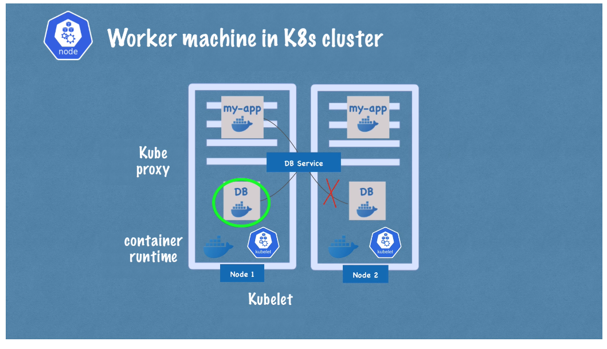
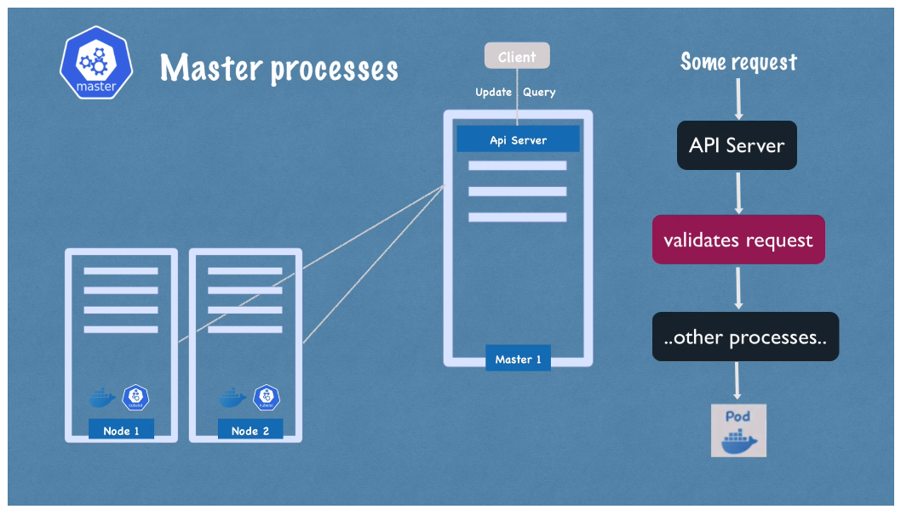
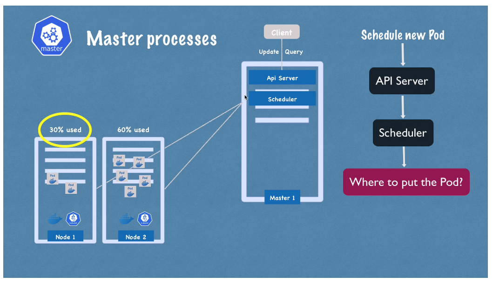
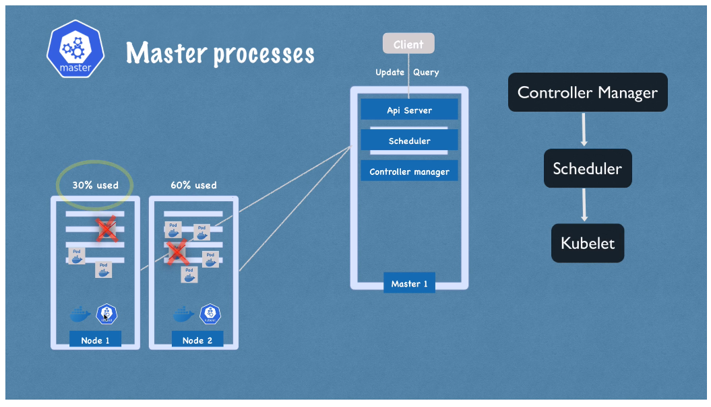
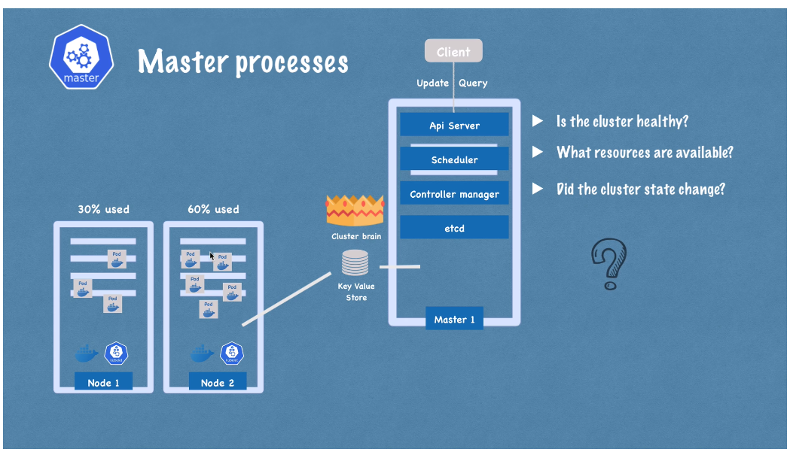
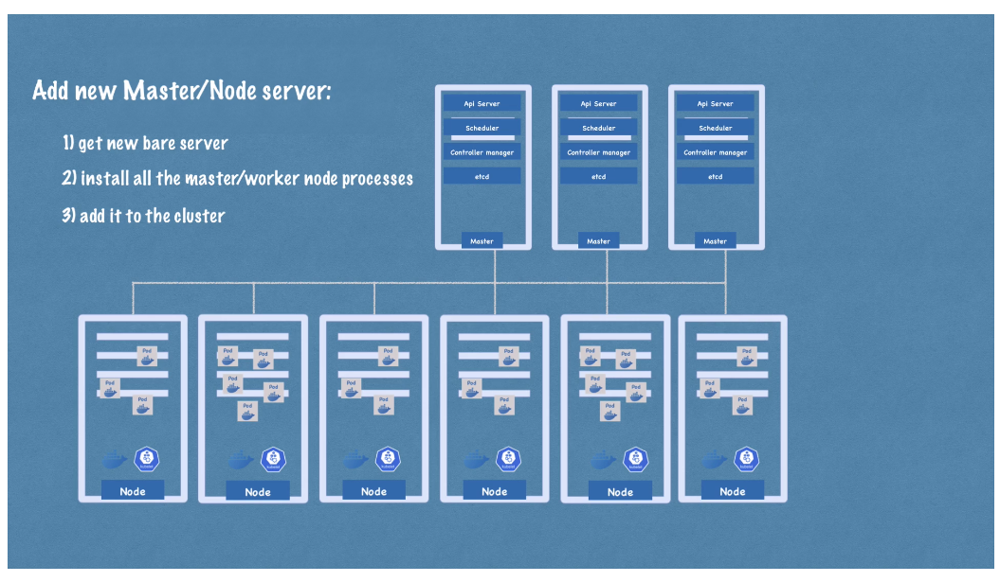

# Kubernetes Architecture

## Node Processes

- **Worker Nodes**: 

  1. Each node has multiple pods on it
  2. Do the actual work
  3. 3 processes must be installed on every node:
     - Container runtime (e.g. Docker, containerd, cri-o)
     - Kubelet: interfaces with both container runtime and node. Takes config
       and starts the pod with container inside, assigns CPU and storage
       resources to pod from node
     - Kube Proxy: forwards requests from services to pods, in a performant way
       with low overhead

- **Manager Nodes**:

  1. 4 processes:

     - API Server: receives updates/queries from client (UI tool, CLI, K8s
       API)to the cluster (to schedule new pods, new services, etc.) Validates
       requests and forwards to other processes as needed.

       

     - Scheduler: Intelligently decides which worker node to start the pod in
       based on which node has available resources.

       

     - Controller Manager: Detects cluster state changes (e.g. death/crash of
       pods) and makes request to Scheduler to restore state to declared
       condition

       

     - `etcd`: The "cluster brain". A key-value store of cluster state. Every
       change in the cluster (e.g. scheduling of a pod, death of a pod etc.)
       gets stored in the key-value store. **Note**: application data is _not_
       stored in `etcd`.

       

A **cluster** includes (usually) multiple manager and worker nodes.

