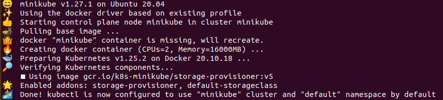

# Minikube and kubectl

**Minikube** is a one-node cluster where both manager and worker processes run.
Docker is pre-installed. **It allows you to deploy new applications/components
on your local machine**. Useful for quickly creating clusters for local
dev/testing purposes.

**kubectl** is a command line tool for K8s clusters. It is a client that allows
you to interact with the Api Server process on the manager node and provision
K8s components/services.

**kubectl** is the tool to interact with **any** K8s cluster (minikube, cloud,
etc).

## Installing Minikube

Minkube can run either as a container or VM. To install on a mac:
`brew install minikube`

See official Minikube documentation for installation instructions for other
platforms.

## Starting Minikube

`minikube start --driver docker`

**Note that starting minikube configures `kubectl` to use "minikube" cluster and
`default` namespace by default!** You will need to reconfigure `kubectl` via a
`kube-config.yaml` file to point to an externally-hosted cluster (e.g. on Linode
Kubernetes Engine).

`minikube status`: Check status of minikube

**kubectl** gets installed as a dependency of Minikube, so no need to install it
separately.

`kubectl get node`: Displays status of all nodes in cluster
