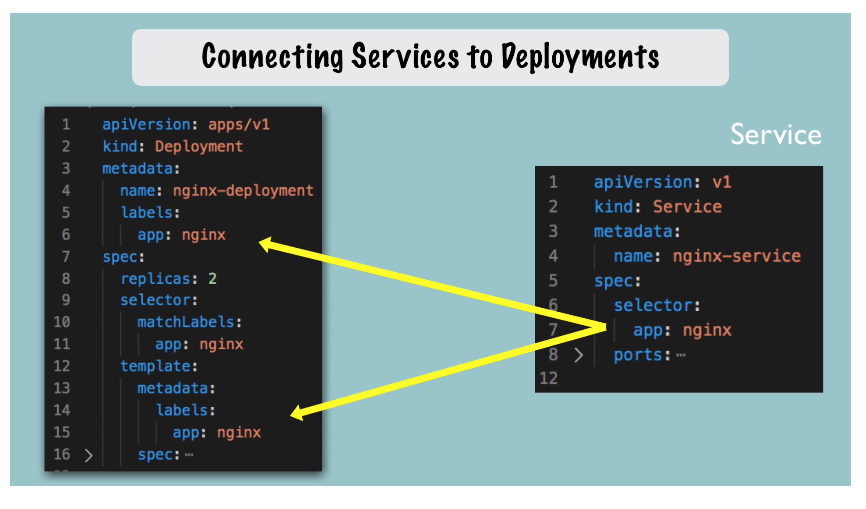

# YAML Configuration File in K8s

## The 3 Parts of a Config File

1. `metadata`
2. `spec`: all the configuration values for the component
   - Attributes are specific to the component type (deployments, services, etc)
3. `status`: **auto-generated** and added by K8s. K8s compares the desired state
   to actual state and fixes actual state accordingly
   - Status info comes from `etcd` process; holds current state of any K8s
     component

**Store these config files in SCM with your source code.**

`deployment-config.yaml`:

```yaml
apiVersion: apps/v1
kind: Deployment
metadata:
  name: nginx-deployment
  labels:
    app: nginx
spec:
  replicas: 1
  selector:
    matchLabels:
      app: nginx
  template: # This configuration applies to PODS created in the deployment
    metadata:
      labels:
        app: nginx
    spec:
      containers:
        - name: nginx
          image: nginx:1.16
          ports:
            - containerPort: 8080
```

`service-config.yaml`:

```yaml
apiVersion: v1
kind: Service
metadata:
  name: nginx-service
spec:
  selector:
    app: ningx
  ports:
    - protocol: TCP
      port: 80 # port at which service is listening
      targetPort: 8080 # pod port to which service forwards request; MUST match containerPort
```

## Blueprint for Pods (Template)

`spec.template` has its own `metadata` and `spec` sections that are the
**templates** for the **pods** created by this deployment.

## Connecting Deployments to Pods: Labels, Selectors, & Ports

### Connecting Deployment to Pod


`labels` metadata key-value pair is assigned in deployment's `metadata`. Pods
get the **same label(s)** in the `template.metadata.labels` attribute. The label
is matched in pods that need to be connected by the deployment in the
`selector.matchLabels.app` metadata. **This is how the pods connect to the
deployment.**

### Connecting Service to Deployment



In a **service**, we have the `spec.selector` attribute. **To connect a service
to a deployment, this attribute shoulld match the `labels` attribute in the
deployment.**

### Connecting Port to Service


To connect a PORT with its SERVICE, The **ports** of the **service** and its
**pods** must match. Match the `containerPort` attribute of the pod, and
`targetPort` attribute of the component.

`kubectl describe service [service-name]`: Displays status info including
TargetPort and Endpoints. Endpoints must be ip addrs and ports of pods to which
service must forward the requests.

`kubectl get pod -o wide`: Displays ip addr of pods

`kubectl get deployment [depl-name] -o yaml`: get updated config file for
deployment, including most recent config values and **updated status**.

`kubectl delete -f [file-name]`: Delete deployment, service, etc. using the
.yaml config file name.
