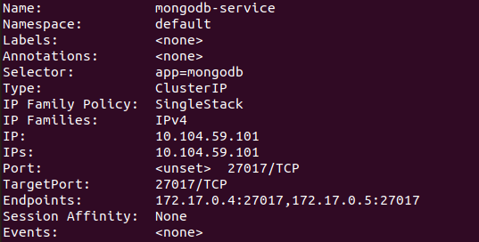

# Complete Demo Project: Deploying App in K8s Cluster

## Overview

1. MongoDB App:

   - Pod
   - Internal Service (no external requests allowed to pod)
   - Only components inside cluster

2. Mongo Express App

   - Need DB URL of Mongo DB

3. Config Map

   - DB URL

4. Secret

   - DB User
   - DB Password

5. External Service
   - allows requests from browser to Mongo Express pod


## Step 1: Create secret config:

_The Secret does NOT get pushed to the code repository. It lives only in K8s so
as not to expose sensitive data._

- `type`:
  - Opaque: default type for arbitrary key-value pairs

**NOTE**: Values in the key-value pairs MUST be base=64 encoded (NOT plain text)

- `echo -n '{value-to-encode}' | base64`: base64 encode a value

`mongo-secret.yaml`:

```yaml
apiVersion: v1
kind: Secret
metadata:
  name: mongodb-secret
type: Opaque
data:
  mongo-root-username: dXNlcm5hbWU=
  mongo-root-password: cGFzc3dvcmQ=
```

## Step 2: Create mongodb deployment config:

`mongo-depl.yaml`:

```yaml
apiVersion: apps/v1
kind: Deployment
metadata:
  name: mongodb-deployment
  labels:
    app: mongodb
spec:
  replicas: 1
  selector:
    matchLabels:
      app: mongodb
  template:
    metadata:
      labels:
        app: mongodb
      spec:
        containers:
          - name: mongodb
            image: mongo
            ports:
              - containerPort: 27017
            env:
              - name: MONGO_INITDB_ROOT_USERNAME
                value:
              - name: MONGO_INITDB_ROOT_PASSWORD
                value:
```

## Step 3: Create secret

- `kubectl apply -f [secret-filename]`

## Step 4: Reference secret in deployment config:

`mongo-depl.yaml`

```yaml
# ...
env:
- name: MONGO_INITDB_ROOT_USERNAME
    valueFrom:
        secretKeyRef:
            name: mongodb-secret // `metadata.name` value in secret config file
            key: mongo-root-username

- name: MONGO_INITDB_ROOT_PASSWORD
    valueFrom:
        secretKeyRef:
            name: mongodb-secret
            key: mongo-root-password
# ...
```

#### Verify that `mongodb` Deployment Pods are Connected to Service:

- `kubectl get pod -o wide`: Outputs the IP addresses of the pods


- `kubectl describe service {mongodb-service-name}`: Prints metadata about
  service, including `Endpoints` attribute which lists the IP addresses of the
  associated pods:



## Step 5: Create InternalService

`mongo.yaml` (**NOTE**: Putting internal service and deployment in **same file**
per convention)

```yaml
apiVersion: apps/v1
kind: Deployment
metadata:
  name: mongodb-deployment
  labels:
    app: mongodb
spec:
  replicas: 1
  selector:
    matchLabels:
      app: mongodb
  template:
    metadata:
      labels:
        app: mongodb
    spec:
      containers:
        - name: mongodb
          image: mongo
          ports:
            - containerPort: 27017
          env:
            - name: MONGO_INITDB_ROOT_USERNAME
              valueFrom:
                secretKeyRef:
                  name: mongodb-secret
                  key: mongo-root-username
            - name: MONGO_INITDB_ROOT_PASSWORD
              valueFrom:
                secretKeyRef:
                  name: mongodb-secret
                  key: mongo-root-password

---
apiVersion: apps/v1
kind: Service
metadata:
  name: mongodb-service
spec:
  selector:
    app: mongodb # to connect to Pod, must match metadata.labels.app in deployment
  ports:
    protocol: TCP
    port: 27017 # Service port
    targetPort: 27017 # containerPort of deployment
```

## Step 6: Create Mongo Express Deployment & Service

**Optional**: Create (shared) `ConfigMap` with mongodb server connection string,
in case multiple applications in the cluster will connect to mongo

`mongo-config-map.yaml`:

```yaml
apiVersion: v1
kind: ConfigMap
metadata:
  name: mongodb-configmap
data: # actual content in key-value pairs
  database_url: mongodb-service
```

`mongo-express.yaml`:

```yaml
apiVersion: apps/v1
kind: Deployment
metadata:
  name: mongo-express-deployment
  labels:
    app: mongo-express
spec:
  replicas: 1
  selector:
    matchLabels:
      app: mongo-express
  template:
    metadata:
      labels:
        app: mongo-express
    spec:
      containers:
        - name: mongo-express
          image: mongo-express
          ports:
            - containerPort: 8081
          env:
            - name: ME_CONFIG_MONGODB_ADMINUSERNAME
              valueFrom:
                secretKeyRef:
                  name: mongodb-secret
                  key: mongo-root-username
            - name: ME_CONFIG_MONGODB_ADMINPASSWORD
              valueFrom:
                secretKeyRef:
                  name: mongodb-secret
                  key: mongo-root-password
            - name: ME_CONFIG_MONGODB_SERVER
              valueFrom:
                configMapKeyRef:
                  name: mongodb-configmap
                  key: database_url
```

Create ConfigMap:

- `kubectl apply -f [config-mapfile]`

Create Deployment:

- `kubectl apply -f [deployment-file]`

## Step 7: Create External Service to Access Mongo Express from Browser

`mongo-express.yaml`:

```yaml
# deployment configuration...
---
apiVersion: v1
kind: Service
metadata:
  name: mongo-express-service
spec:
  selector:
    app: mongo-express
  type: LoadBalancer # Add 'type: LoadBalancer': assigns service an **external** IP so it accepts extenal requests
  ports:
    - protocol: TCP
      port: 8081
      targetPort: 8081
      nodePort: 30000 # Port for external ip addrs (you will put this port in browser). Must be betw 30000-32767
```

## Step 8: Assign External IP Address (Minikube Only)

- `minikube service [service-name]`


