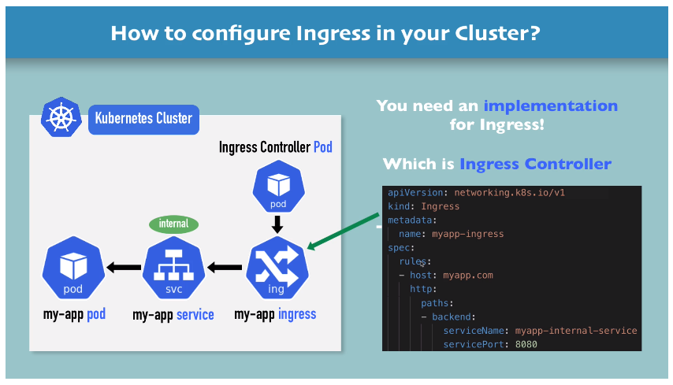

# Ingress - Connecting to Applications Outside Cluster

## External Service vs. Ingress

**External** Service: Access the application via http protocol, using the node
IP address and the port: [http]://[service-ip]:[service-port] Browser -->
`http://124.89.101.2:35010` --> service --> pod

```yaml
apiVersion: v1
kind: Service
metadata:
  name: my-app-external-service
spec:
  selector:
    app: my-app
  type: LoadBalancer
  ports:
    - protocol: TCP
      port: 8080
      targetPort: 8080
      nodePort: 35010 # The port that the user enters into the browser; see above
```

Good for **testing** and **development**, not optimal for production.

**Ingress**: Access the application via http/https (must configure) protocol,
using the **domain name** of the application. IP address and port are NOT opened
to public: Browser --> `http://my-app.com` --> ingress --> internal service -->
pod


## Ingress Configuration:

```yaml
apiVersion: networking.k8s.io/v1
kind: Ingress
metadata:
  name: myapp-ingress
spec:
  rules: # Routing rules
    - host: myapp.com # must be valid domain addr; map domain name (that user inputs into browser) to node's IP address (http.paths.backend.serviceName), which is the entrypoint
      http:
        paths: # the URL path after "/{domain-name}"
          - backend:
              serviceName: myapp-internal-service # Forward request to internal service identified by name of internal service (below)
              servicePort: 8080
```

## Internal Service Configuration

```yaml
apiVersion: v1
kind: Service
metadata:
  name: myapp-internal-service
spec:
  selector:
    app: myapp
  ports:
    - protocol: TCP
      port: 8080
      targetPort: 8080
      # Note: no nodePort attribute!
```

## How to Configure Ingress in your Cluster?

You need an **Ingress Controller**, another pod/set of pods in your cluster that
evaluate and process ingress rules, and manage redirection. This will be the
entrypoint for all requests to the domain/subdomain of the cluster. You can use
many different 3rd-party implementations of Ingress Controller.



### Install Ingress Controller in Minikube

- `minikube addons enable ingress`: Automatically starts the K8s nginx
  implementation of Ingress Controller. **Note**: OK to use for production.

### Create Ingress Rule

- `kubectl get all -n [name]`: If there is a pod and internal service running
  for `name`, OK to create Ingress Rule:

`ingress.yaml`:

```yaml
apiVersion: networking.k8s.io/v1
kind: Ingress
metadata:
  name: dashboard-ingress
  namespace: kubernetes-dashboard #same namespace as service and pod
spec:
  rules:
    - host: dashboard.com
      http:
        paths:
          - backend:
              serviceName: kubernetes-dashboard
              servicePort: 80
```

- `kubectl apply -f ingress.yaml`

- `kubectl get ingress -n kubernetes-dashboard`: Note IP address

- For **LOCAL** Domain Name Mapping:
  1. `nano /etc/hosts`
  2. Add `[ip-address] dashboard.com` to end of file and save.
  3. You should be able to enter "dashboard.com" in a browser and see your K8s
     dashboard.

### Ingress Default Backend

## More Use Cases

1. Multiple paths for same host: e.g. Google has one domain but many
   services/application accessible from same domain.
   - in `rules/host/http/paths`, define multiple `path` configs
2. Multiple subdomains or domains:
   - in `rules`, define multiple `host` configs
3. Configuring TLS Certs:

   - `spec.tls`: Define a `secretName` attribute
   - Create a `Secret` component:

   ```
       apiVersion: v1
       kind: Secret
       metadata:
           name: myapp-secret-tls
           namespace: default // must be in same namespace as Ingress component
       data:
           tls.crt: {base64-encoded-cert}
           tls.key: {base64-encoded-key}
       type: kubernetes.io/tls
   ```

   `ingress.yaml`:

   ```yaml
       #...
       spec:
           tls:
           - hosts:
               - myapp.com
               secretName: myapp-secret-tls
       # ...
   ```
