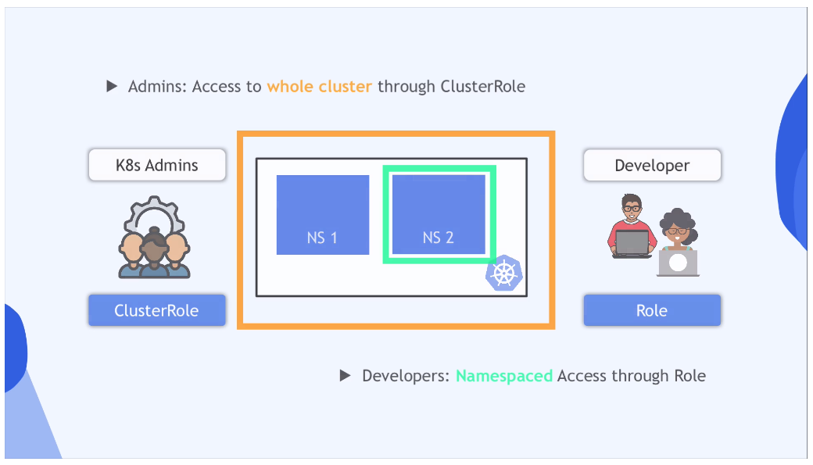
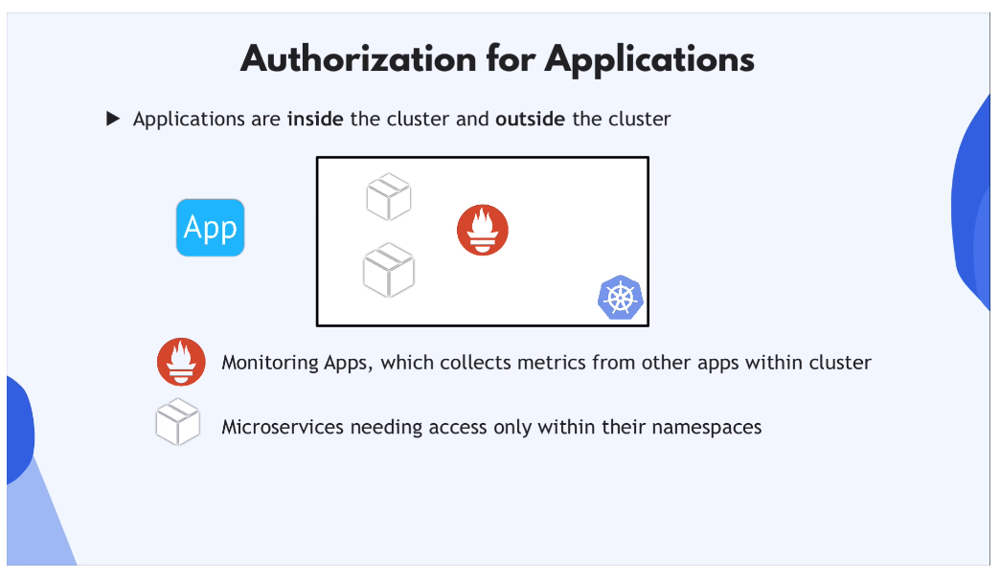

# Secure Your Cluster with RBAC

## Why Authorization?

Why do we need permissions in our K8s cluster?

**Administrators** need different access than **Developers**. Users should have
the least privileges they need to get their jobs done.

## Role and Role Binding

Ex. You have multiple development teams, working in different namespaces. **How
to restrict access of the team to their own namespace?**

Using **RBAC**, you can define access to each namespace using **roles**:

- With **Role** component, you can define namespaced permissiong

- Roles are bound to a **specific namespace**

- Define **what resources** in that namespace you can access, and **what
  actions** youc an do with this resource.

You can create a role for each team that defines the resources and access
permissions on those resources.

To attach a role to a dev team (or individual developer), use the
**RoleBinding** component. With role binding, all the members of the group get
the permissions.



### Cluster Role and ClusterRoleBinding

K8s **admins** manage the namespaces in the cluster and configure cluster-wide
volumes. Roles don't work because roles are limited to **namespaces**.

**ClusterRoles** define what permissions are attached to what resources
**cluster-wide**.

### Creating Users and Groups in K8s

K8s doesn't manage users and gruops natively. Admins can choose from different
external authentication strategies and sources:

- static token file
- certificates
- 3rd party identity service (LDAP, etc.)

The **API Server** then attempts to authenticate requests coming in using the
selected authentication source.

## Service Accounts

Now the **human** user permissions are taken care of, but what about the
**application** permissions?



Internal and external applications may need access to the K8s cluster. The
**ServiceAccount** component represents application access to the cluster. You
can link ServiceAccount to a Role or ClusterRoleBinding component similarly to
users and groups.

## Configuration Files

**Role** configuration file:

```yaml
apiVersion: rbac.authorization.k8s.io/v1
kind: Role
metadata:
  name: developer
  namespace: my-app # give access to resources in a specific ns
rules:
  - apiGroups: [''] # "" indicates the core API group
    resources: ['pods'] # K8s components like Pods, Deployments, etc.
    verbs: ['get', 'create', 'list'] # the actions on a resource
  - apiGroups: ['']
    resources: ['secrets']
    verbs: ['get']
```

You can target access more granularly by using the `resourceNames` attribute:

```yaml
# ...
rules:
  - apiGroups: ['']
    resources: ['pods']
    verbs: ['get', 'create', 'list']
    resourceNames: ['my-app']
  - apiGroups: ['']
    resources: ['secrets']
    verbs: ['get']
    resourceNames: ['mydb']
```

**RoleBinding** config file (attaches role to user, group, or service):

```yaml
apiVersion: rbac.authorization.k8s.io/v1
kind: RoleBinding
metadata:
  name: jane-developer-binding
subjects:
  - kind: User
    name: jane
    apiGroup: rbac.authorization.k8s.io
roleRef:
  kind: Role
  name: developer
  apiGroup: rbac.authorization.k8s.io
```

```yaml
apiVersion: rbac.authorization.k8s.io/v1
kind: RoleBinding
metadata:
  name: jane-developer-binding
subjects:
  - kind: Group
    name: devops-admins
    apiGroup: rbac.authorization.k8s.io

# subjects:
#     kind: ServiceAccount
#     name: default
#     namespace: kube-system

roleRef:
  kind: Role
  name: developer
  apiGroup: rbac.authorization.k8s.io
```

**ClusterRole** config file:

```yaml
apiVersion: rbac.authorization.k8s.io/v1
kind: ClusterRole
metadata:
  name: cluster-admin
rules:
  - apiGroups: ['']
    resources: ['nodes']
    # resources: ["namespaces"]
    verbs: ['get', 'create', 'list', 'delete', 'update']
```

## Creating and Viewing RBAC Resources

You create Role, ClusterRole, etc. just like any other K8s component:

- `kubectl apply -f {file-name}.yaml`

View Components with `get` and `describe` commands:

- `kubectl get roles`

- `kubectl describe role developer`

## Checking API Access

Kubectl proves an `auth can-i` subcommand which you can use to quickly check if
a current use can perform a given action:

- `kubectl auth can-i create deployments --namespace dev`

Admins can also check permissions of other users.

## Wrap-up

K8s has **2 levels of security**:

1. **Authentication**: ApiServer checks if user/service is **allowed to connect
   to the cluster** (access credentials?)

2. **Authorization**: Checks what role/cluster role user has to perform the
   actions it's requesting using RBAC.
