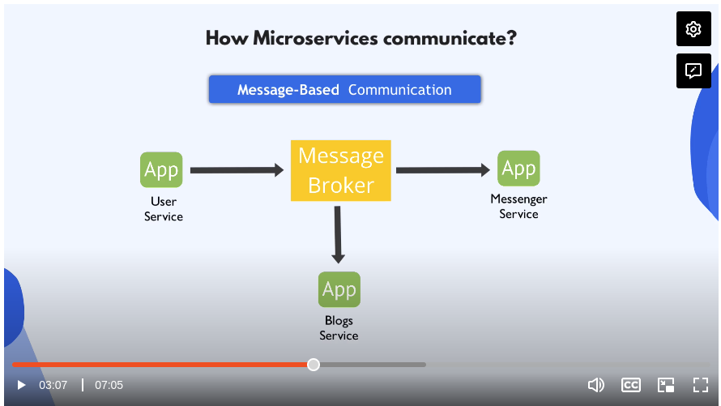
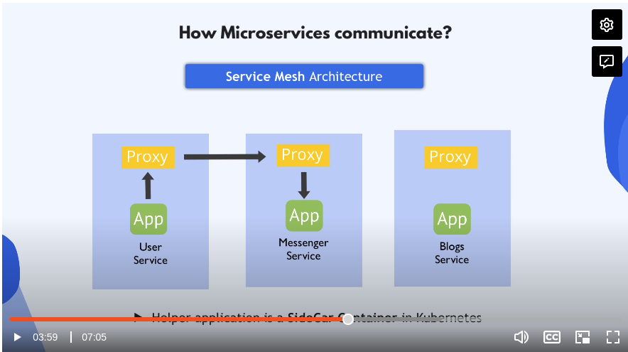

# Microservices in K8s

## Intro to Microservices
K8s emerged as a platform for microservice appplications. Microservices can be developed and deployed independently of one another.

Applications can be smaller, developed, packaged, and released independently.

### How do Microseverices communicate?

1. **Interfaces** or APIs: communication code is inside the ms application(s)

2. **Message Brokers** manage communication between the apps. Ex: Redis, Rabbit MQ

3. **Service Mesh**: Each ms has its own helper program that handles communication for that specific service. Ex: Istio:

## What to Know as a DevOps Engineer

Usually yor task will be to deploy **existing** ms application in a K8s cluster.

What information do you need from the developers?
- Which ms to deploy
- Which ms is talking to which ms
- How are they communicating: APIs? Message Broker? Service Mesh?
- Which DB/3rd party services are they using
- Which ports the ms run on
