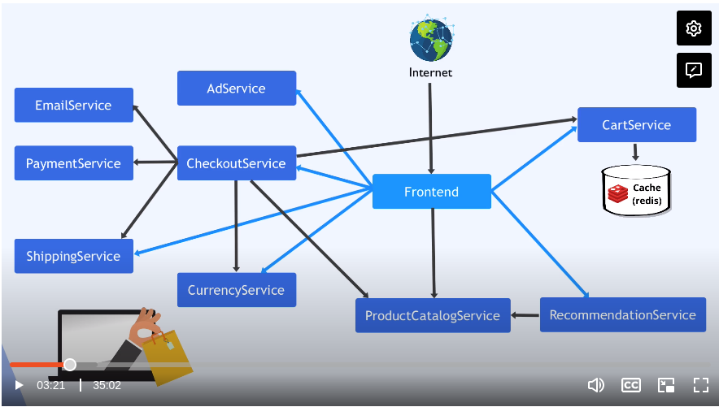

# Demo Project: Deploy Microservices Application

As a devops engineer, you should understand:

1. What ms are we deploying?
2. How are they connected?
3. Any 3rd party services (e.g. message brokers) or databases?
4. Which service is accessible from outside the cluster/ the entrypoint service?
5. Image name for each service
6. What env vars each image expects
7. Ports for each MS



## Create Deployment & Service Config Files

1. Create directory and config file for all ms:

`config.yaml`:

```yaml
---
apiVersion: apps/v1
kind: Deployment
metadata:
    name: emailservice
spec:
    selector:
        matchLabels:
            app: emailservice
    template:
        metadata:
            labels:
                app: emailservice
        spec:
            containers:
            - name: service
              image: gcr.io/google-samples/micorservices-demo/emailservice
              ports:
              - containerPort: 8080
              env:
              - name: PORT
                value: "8080"
---
apiVersion: v1
kind: Service
metadata:
    name: emailservice
spec:
    type: ClusterIP
    selector:
        app: emailservice
    ports:
        - protocol: TCP
          port: 5000
          targetPort: 8080

---

---
apiVersion: apps/v1
kind: Deployment
metadata:
    name: xxx
spec:
    selector:
        matchLabels:
            app: xxx
    template:
        metadata:
            labels:
                app: xxx
        spec:
            containers:
            - name: xxx
              image: xxx
              ports:
              - containerPort: xxx
---
apiVersion: v1
kind: Service
metadata:
    name: xxx
spec:
    selector:
        app: xxx
    ports:
        - protocol: TCP
          port: 80
          targetPort: 8080

---

---
apiVersion: apps/v1
kind: Deployment
metadata:
    name: xxx
spec:
    selector:
        matchLabels:
            app: xxx
    template:
        metadata:
            labels:
                app: xxx
        spec:
            containers:
            - name: xxx
              image: xxx
              ports:
              - containerPort: xxx
---
apiVersion: v1
kind: Service
metadata:
    name: xxx
spec:
    selector:
        app: xxx
    ports:
        - protocol: TCP
          port: 80
          targetPort: 8080

---

---
apiVersion: apps/v1
kind: Deployment
metadata:
    name: xxx
spec:
    selector:
        matchLabels:
            app: xxx
    template:
        metadata:
            labels:
                app: xxx
        spec:
            containers:
            - name: xxx
              image: xxx
              ports:
              - containerPort: xxx
---
apiVersion: v1
kind: Service
metadata:
    name: xxx
spec:
    selector:
        app: xxx
    ports:
        - protocol: TCP
          port: 80
          targetPort: 8080

---

---
apiVersion: apps/v1
kind: Deployment
metadata:
    name: xxx
spec:
    selector:
        matchLabels:
            app: xxx
    template:
        metadata:
            labels:
                app: xxx
        spec:
            containers:
            - name: xxx
              image: xxx
              ports:
              - containerPort: xxx
---
apiVersion: v1
kind: Service
metadata:
    name: xxx
spec:
    selector:
        app: xxx
    ports:
        - protocol: TCP
          port: 80
          targetPort: 8080

---

---
apiVersion: apps/v1
kind: Deployment
metadata:
    name: xxx
spec:
    selector:
        matchLabels:
            app: xxx
    template:
        metadata:
            labels:
                app: xxx
        spec:
            containers:
            - name: xxx
              image: xxx
              ports:
              - containerPort: xxx
---
apiVersion: v1
kind: Service
metadata:
    name: xxx
spec:
    selector:
        app: xxx
    ports:
        - protocol: TCP
          port: 80
          targetPort: 8080

---

---
apiVersion: apps/v1
kind: Deployment
metadata:
    name: xxx
spec:
    selector:
        matchLabels:
            app: xxx
    template:
        metadata:
            labels:
                app: xxx
        spec:
            containers:
            - name: xxx
              image: xxx
              ports:
              - containerPort: xxx
---
apiVersion: v1
kind: Service
metadata:
    name: xxx
spec:
    selector:
        app: xxx
    ports:
        - protocol: TCP
          port: 80
          targetPort: 8080

---

---
apiVersion: apps/v1
kind: Deployment
metadata:
    name: xxx
spec:
    selector:
        matchLabels:
            app: xxx
    template:
        metadata:
            labels:
                app: xxx
        spec:
            containers:
            - name: xxx
              image: xxx
              ports:
              - containerPort: xxx
---
apiVersion: v1
kind: Service
metadata:
    name: xxx
spec:
    selector:
        app: xxx
    ports:
        - protocol: TCP
          port: 80
          targetPort: 8080

---

---
apiVersion: apps/v1
kind: Deployment
metadata:
    name: xxx
spec:
    selector:
        matchLabels:
            app: xxx
    template:
        metadata:
            labels:
                app: xxx
        spec:
            containers:
            - name: xxx
              image: xxx
              ports:
              - containerPort: xxx
---
apiVersion: v1
kind: Service
metadata:
    name: xxx
spec:
    selector:
        app: xxx
    ports:
        - protocol: TCP
          port: 80
          targetPort: 8080

---

---
apiVersion: apps/v1
kind: Deployment
metadata:
    name: xxx
spec:
    selector:
        matchLabels:
            app: xxx
    template:
        metadata:
            labels:
                app: xxx
        spec:
            containers:
            - name: xxx
              image: xxx
              ports:
              - containerPort: xxx
---
apiVersion: v1
kind: Service
metadata:
    name: xxx
spec:
    selector:
        app: xxx
    ports:
        - protocol: TCP
          port: 80
          targetPort: 8080

---

---
apiVersion: apps/v1
kind: Deployment
metadata:
    name: xxx
spec:
    selector:
        matchLabels:
            app: xxx
    template:
        metadata:
            labels:
                app: xxx
        spec:
            containers:
            - name: xxx
              image: xxx
              ports:
              - containerPort: xxx
---
apiVersion: v1
kind: Service
metadata:
    name: xxx
spec:
    selector:
        app: xxx
    ports:
        - protocol: TCP
          port: 80
          targetPort: 8080

---

```
