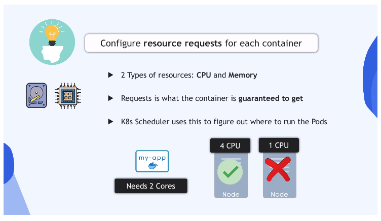

# Microservices in K8s Part 3: Production and Security Best Practices

Even though our MS application is **running**, we created it with several **bad
practices**. We'll learn about **best practices** in this module.

## Best Practice #1: Specify a Pinned Version on Each Container Image

Define a _specific image version_ for each container. Otherwise, K8s will pull
the **latest** image version by default, which makes it unpredictable which
version you have running in your cluster.

**NO**:

```yaml
spec:
  containers:
    - name: app
      image: nginx
```

**YES**:

```yaml
spec:
  containers:
    - name: app
      image: nginx:1.19.8
```

## Best Practice #2: Liveness Probe for Each Container

Configure a **liveness probe** on each container. K8s automatically restarts a
pod when it crashes, but what about **the application inside the pod**? The pod
continues to run, even if the **application** is in a healthy state (container
crashed, etc.)!

We can inform K8s of the state of the **application** with a **Liveness Probe**.
With a liveness probe defined, K8s will **automatically re-start the pod when
the application is crashing**.

```yaml
# ...
spec:
  containers:
    - name: service
      image: gcr.io/google-samples/microservices-demo/emailservice:v0.2.3
      ports:
        - containerPort: 8080
      env:
        - name: PORT
          value: '8080'
      # define liveness probe attr
      livenessProbe:
        periodSeconds: 5
        exec:
          command: ['/bin/grpc_health_probe', '--addr=:8080'] # You create a program to check the state of the application; K8s will execute these commands
```

## Best Practice #3: Configure Readiness Probe for Each Container

Liveness probes perform health checks **only after the container is started**.
What about the startup process?

**Readiness Probe** lets K8s know that the application is ready to receive
traffic. To configure a readiness probe:

```yaml
spec:
  containers:
    - name: service
      image: gcr.io/google-samples/microservices-demo/emailservice:v0.2.3
      ports:
        - containerPort: 8080
      env:
        - name: PORT
          value: '8080'
      livenessProbe:
        periodSeconds: 5
        exec:
          command: ['/bin/grpc_health_probe', '--addr=:8080']
      # configure readinessProbe attr with the same attributes as livenessProbe
      readinessProbe:
        periodSeconds: 5
        exec:
          command: ['/bin/grpc_health_probe', '--addr=:8080']
```

## Best Practice #4: Configure Resource Requests for Each Container

**Resource requests** guarantee that the given pod receives the **CPU** and
**memory** resources you specify. The K8s Scheduler uses this to decide which
nodes in which to start the pod(s).



```yaml
# ...
spec:
  containers:
    - name: service
      image: gcr.io/google-samples/microservices-demo/emailservice:v0.2.3
      ports:
        - containerPort: 8080
      env:
        - name: PORT
          value: '8080'
      livenessProbe:
        periodSeconds: 5
        exec:
          command: ['/bin/grpc_health_probe', '--addr=:8080']
      readinessProbe:
        periodSeconds: 5
        exec:
          command: ['/bin/grpc_health_probe', '--addr=:8080']
      resources:
        requests:
          # "Average" values, or add your container-specific values below
          cpu: 100m # m = millicore
          memory: 64Mi # Mi = mebibyte
```

## Best Practice #5: Reasource Limits for Each Container

What if a running application needs more resources as it is running, and
consumes **more** than the requested memory? **Resource Limits** ensure that one
container never consumes more resources on the node than it should:

```yaml
#...

spec:
  containers:
    - name: service
      image: gcr.io/google-samples/microservices-demo/emailservice:v0.2.3
      ports:
        - containerPort: 8080
      env:
        - name: PORT
          value: '8080'
      livenessProbe:
        periodSeconds: 5
        exec:
          command: ['/bin/grpc_health_probe', '--addr=:8080']
      readinessProbe:
        periodSeconds: 5
        exec:
          command: ['/bin/grpc_health_probe', '--addr=:8080']
      resources:
        requests:
          cpu: 100m
          memory: 64Mi
        # define resource limits
        limits:
          cpu: 200m
          memory: 128Mi
```

## Best Practice #6: Do NOT Expose a Node Port

Do not expose an external service using a NodePort type! It exposes the cluster
to a security risk because it exposes a port on all worker nodes in the cluster
that is open to external requests.

The **best practice** is to have **one entrypoint to the cluster**, ideally
sitting outside the cluster on a separate server. Use internal services for
communcation between nodes inside the cluster. Use the **LoadBalancer** type,
leveraging the cloud provider's native load balancer, for requests coming
in/going out of the cluster.

## Best Practice #7: Configure More than 1 Replica for Deployment

Having just one replica means that you will have downtime if the pod crashes. We
can avoid this easily by declaring the `replicas` attribute and setting it to
`2` or greater.

## Best Practice #8: Use More than 1 Worker Node for your Cluster

Replicate your worker nodes to avoid having a single point of failure if that
node fails. Use labels for all your resources with the `labels` attribute.
Labels give custom identifiers to your components that you can reference in
other component files

## Best Practice #9: Use Namespaces

**Namespaces** logically isolate your K8s cluster components from one another.
They are useful for grouping resources, **as well as defining privileges** (see
discussion of Roles and RoleBindings).

## Security Best Practices

- Ensure **Images** are free of vulnerabilities with manual and/or automated
  security scans in build pipeline

- No Root Access for containers: A container with root access can do much more
  on the host. If the contianer is hacked it can do a lot of damage! Most
  official images do not use the root user, but it's a good practice to check
  3rd-party containers.

- Update K8s version to the latest version in your cluster(s).
