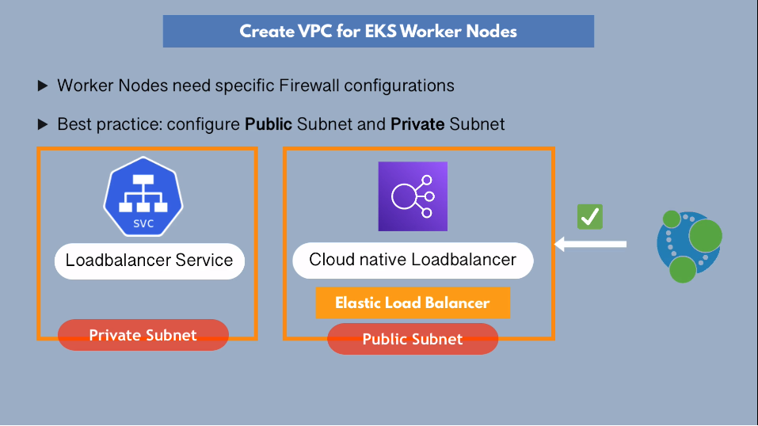

## Create an EKS Cluster with AWS Management Console

**Step 1: Create IAM Role:**

- Create IAM role in AWS to allow AWS EKS service to create/manage components on
  our behalf:

  - Create pods on EC2 instances
  - check info on nodes
  - etc

- Assign role to AWS EKS service managed by AWS:

1. AWS Console > AWS Service > EKS > EKS Cluster > AmazonEKSClusterPolicy
2. (Optional) Add tags for role > Next
3. Add role name, description (optional) > Create Role

**Step 2: Create VPC for Worker Nodes:**

- Why do we need to create another VPC? AWS creates a **default** VPC for each
  AZ. EKS cluster needs a specific networking configuration to work properly.
  K8s specific and AWS specific networking rules **must work together**. Default
  VPC is **not** optimized for this. Also, worker nodes need specific firewall
  configs for manager/worker nodes to communicate.The VPC we're creating
  contains the **worker** nodes for our cluster. The **manager** nodes run in an
  AWS-managed account **outside** our account/VPC where the worker nodes live.

- Best practice: configure public subnet and private subnet

- Give K8s permission to change VPC configs through IAM role:
  - open ports on worker node(s)

**Use AWS-provided template to create your VPCs (CloudFormation template)**:

1. AWS Console > Services > CloudFormation > Create stack
2. Specify template > Amazon S3 url
3. Copy link from EKS user guide (AWS docs) to create public/private subnets and
   paste > Amazon S3 Url > Next
4. Add stack name, advanced options (optional) > Next
5. Review configuration > Create stack

**Step 3: Create EKS cluster (Manager Nodes):**

1. AWS Console > Services > EKS > Create EKS cluster > input cluster name
2. Configure Cluster > add cluster name > Kubernetes version > select cluster
   service role to allow K8s control plane to manage your AWS resources
3. Enable envelope encryption (optional if K8s Secret encryption is needed) >
   Next
4. Specify networking > select VPC where worker nodes are running (NOT the
   default VPC) > select security group of worker nodes VPC
5. Cluster endpoint access (How to access cluster via ApiServer component in AWS
   managed account; connect to manager nodes):
   - Public: accessible from outside VPC (e.g. kubectl running from local
     laptop)
   - **Public and Private**: (optimal)
   - Private: enables manager and worker nodes to communicate via our VPC > Next
6. Enable logging for control plane/manager nodes (optional) > Next
7. Review and create cluster > Create

**Step 4: Connect local `kubectl` with EKS cluster:**

1. `aws configure list`: Ensure that `region` is the same region where EKS
   cluster is located
2. `aws eks update-kubeconfig --name <cluster-name>`
3. `cat <kubeconfig-filename>`
4. `kubectl cluster-info`: Verify that "K8s master" endpoint is the same as in
   AWS console > cluster name > "Details" tab

**Step 5: Create EC2 IAM role for Node Group:**

- Manager nodes (control plane) is created for you; you must create the worker
  nodes for your EKS cluster. You can run worker pods via EC2 (self-managed
  worker nodes) or Fargate (AWS-managed worker nodes) in EKS

- Worker nodes run worker processes, e.g. Kubelet (for scheduling, manageing
  pods, and **communciating with other AWS services**).

- Kubelet on worker node (EC2 instance) needs **permission to interact w/ AWS
  services**.

Create IAM role for EC2 Node Group (to give Kubelet permission to execute API
calls to other AWS services):

1. AWS Console > IAM > Create Role > EC2 > Next
2. Attach permissions policies:
   - AmazonEKSWorkerNodePolicy
   - AmazonEC2ContainerRegistryReadOnly
   - AmazonEKS_CNI_Policy
3. Next > Review > add role name and optional metadata > Create role

**Step 6: Create Node Group and Attach to EKS cluster:**

- Now that you've created the role, you can add node groups to your EKS cluster

1. AWS Console > Services > EKS
2. Select your cluster name > Node Group configuration
3. Add node group name. Select EC2 role created in Step 5 > Next
4. Configure your EC2 image, instance type, volume size
5. Node group scaling configuration:
   - minimum size
   - maximum size: max number of nodes the group can scale out to
   - desired size: Desired number of nodes that the group should launch
     initially
6. Next > Specify networking > Select SSH key pair for connecting to EC2 worker
   nodes from ssh, or create new SSH key pair
7. Next > Review and Create > Create
8. `kubectl get nodes`: should see your nodes after a few minutes

**Step 7: Configure Auto-scaling:**

**Step 8: Deploy Application to EKS Cluster:**
