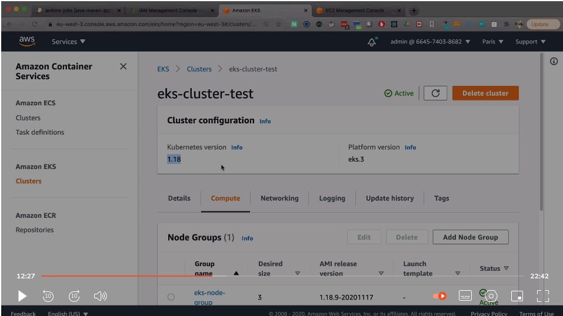
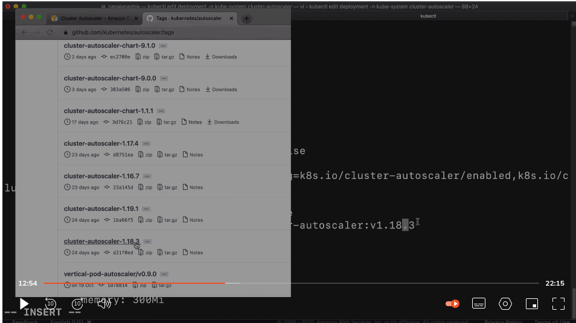
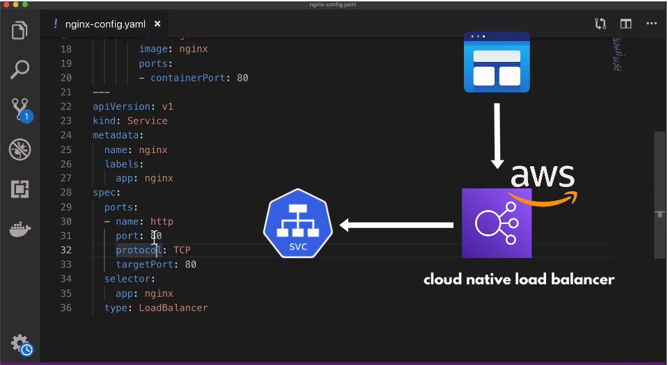

## Configure Autoscaling in EKS Cluster

EKS does NOT automatically scale your instances. You must configure
`K8s Autoscaler` component to scale instances up/down automatically. To
configure Autoscaler:

1. Create Auto-Scaling Group (already done in previous lesson)
2. Create custom policy and attach to Node Group IAM Role (EC2 instances in
   worker nodes need permissions to make certain AWS API calls):

   - AWS console > IAM > Policies
   - Create a custom policy with the following permissions:

   ```json
   {
     "Version": "2012-10-17",
     "Statement": [
       {
         "Action": [
           "autoscaling:DescribeAutoScalingGroups",
           "autoscaling:DescribeAutoScalingInstances",
           "autoscaling:DescribeLaunchConfigurations",
           "autoscaling:DescribeTags",
           "autoscaling:SetDesiredCapacity",
           "autoscaling:TerminateInstanceInAutoScalingGroup",
           "ec2:DescribeLaunchTemplateVersions"
         ],
         "Resource": "*",
         "Effect": "Allow"
       }
     ]
   }
   ```

   - Attach new policy to EKS node group with your worker nodes: Console > IAM >
     roles > {node group role name} > Attach Permissions > attach new policy

   - Configure the following tags on the autoscaling group to allow autoscaler
     to auto-discover autoscaling groups in the cluster:
     - `k8s.io/cluster-autoscaler/eks-cluster-test`: "Yes"
     - `k8s.io/cluster-autoscaler/enabled`: "Yes"

3. Deploy K8s Autoscaler

   - Deploy cluster autoscaler component. From terminal:
     `kubectl apply -f https://raw.githubusercontent.com/kubernetes/autoscaler/master/cluster-autoscaler/cloudprovider/aws/examples/cluster-autoscaler-autodiscover.yaml`

   This file defines the Cluster Autoscaler deployment configuration.

   `kubectl get deployment -n kube-system cluster-autoscaler`: Check that the
   autoscaler deployment has been created.

   - Edit deployment:
     `kubectl edit deployment -n kube-system cluster-autoscaler`

   ```yaml
   #...
   metadata:
     annotation:
       # add this annotation
       cluster-autoscaler.kubernetes.io/safe-to-evict: 'false'
   # ...
   spec:
     containers:
       - command:
       # ...
       - --node-group-auto-discovery=asg:tag=k8s.io/cluster-autoscaler/enabled,k8s.io/cluster-autoscaler/{INSERT
         YOUR CLUSTER NAME}
       - --balance-similar-node-groups
       - --skip-nodes-with-system-pods=false
     image:
       k8s.gcr.io/autoscaling/cluster-autoscaler:{INSERT IMAGE VERSION THAT
       MATCHES K8S VERSION OF YOUR AUTOSCALING GROUP IN AWS HERE}
   ```

   

   

   - `kubectl get pods -n kube-system`: get all pods running in `kube-system`
     namespace

   - `kubectl get pod {autoscaler-pod-name} -n kube-system -o wide`: get wide
     output of autoscaler pod

   - `kubectl logs {autoscaler-pod-name} -n kube-system`: Get logs for
     autoscaler pod

   ## Deploying Pods in your EKS Cluster

   This section walks through an example of deploying a simple application and
   service into the created EKS cluster.

   `nginx-config.yaml`:

   ```yaml
    ---
    apiVersion: apps/v1
    kind: Deployment
    metadata:
        name: nginx
    spec:
        selector:
            matchLabels:
                app: nginx
        replicas: 1
        template:
            metadata:
                labels:
                    app: nginx
            spec:
                containers:
                - name: nginx
                  image: nginx
                  ports:
                  - containerPort: 80
    ---
    apiVersion: v1
    kind: Service
    metadata:
        name: nginx
        labels:
            app: nginx
    spec:
        ports:
        - name: http
          port: 80
          protocol: TCP
          targetPort: 80
        selector:
            app: nginx
        type: LoadBalancer
   ```

   AWS spins up a cloud native load balancer for this service:

   

   1. Apply deployment manifest: `kubectl apply -f nginx-config.yaml`

   2. Check for created pod: `kubectl get pod` `kubectl get service`

   3. You should be able to see your newly-created load balancer in the EC2
      dashboard of the AWS console.

## Increase Load on Worker Node to Trigger Autoscaling (example):

1. `kubectl get deployment`: get name of application deployed to worker nodes

2. `kubectl edit deployment nginx`: Increase `spec.replicas` as desired

3. `kubectl get pod`: check pods creating

4. `kubectl get pod -n kube-system` `kubectl logs {autoscaler-name`}: Check
   autoscaling status
