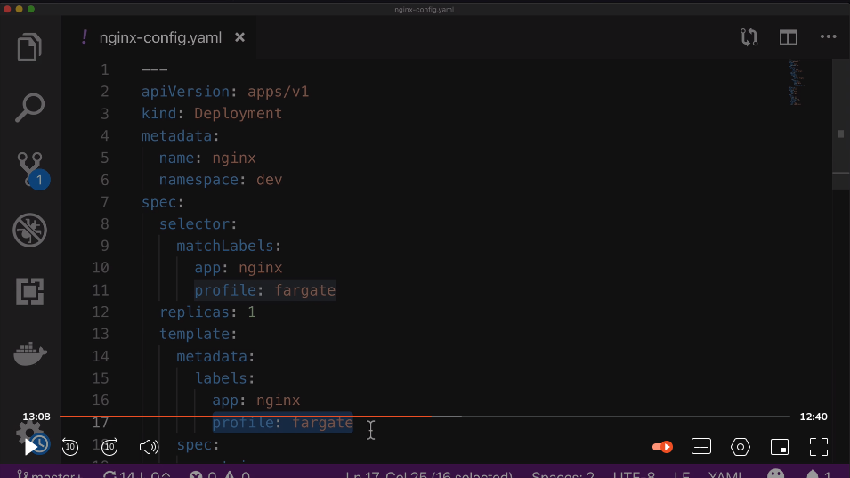
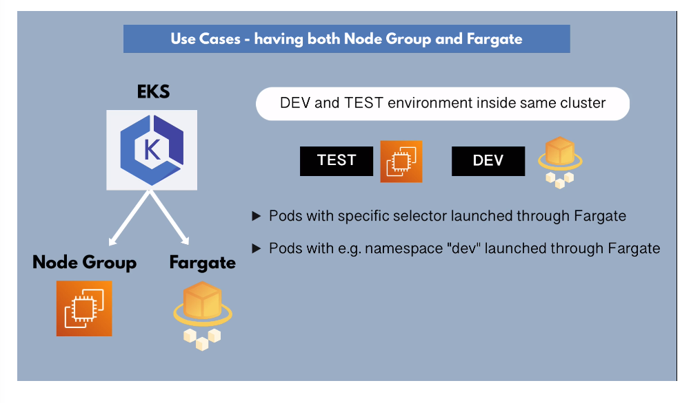

# Create Fargate Profile for EKS Cluster

**Fargate** is a serverless alternative to creating EC2 instances in node
groups. Nothing is created in our AWS account; everything (worker and manager
nodes) all run in AWS-managed account.

Fargate provisions its own VM for **each pod**. We can run multiple pods on each
EC2 instance. Therefore, Fargate does not support stateful applications and
DaemonSets.

## Create a Fargate Profile, Attach to ECS Cluster and Deploy a Pod

### 1. Create IAM Role for Fargate:

When our cluster creates pods in Fargate, the pods (kubelet) need to make calls
to AWS services on our behalf. We need to create a role to allow Fargate VMs to
do this.

- Console > Services > EKS > Select your use case > EKS - Fargate pod > Next

- AmazonEKSFargatePodExecutionRolePolicy > Next

- Review > add role name > Create

### 2. Create Fargate Profile

A **Fargate Profile** defines the criteria that allows Fargate to decide how a
pod should be scheduled.

- Console > Services > EKS > Clusters > your cluster name > Add Fargate Profile

- Add profile name > Pod execution role (select)

- Why do we need to provide our VPC? Because the pods that Fargate will
  provision will have an IP address from our subnet IP range.

- Subnets > remove public subnets > Next

- Pod Selectors > Use the `namespace` attribute value from the deployment
  `.yaml` manifest in the "namespace" field

- Match labels > Add label > add label key/value pairs to match pods as defined
  in `.yaml` manifest > Create

### 3. Deploy Pod through Fargate

We will now apply `.yaml` file to create pods.

- `kubectl get pod`: shows current status; no pods created through fargate yet

- `kubectl create ns dev`: create 'dev' namespace

- `kubectl apply -f {config-file.yaml}`

- `kubectl get pods -n dev`: Display our new pod in `dev` ns

- `kubectl get nodes`: Displays our EC2 instance that was just created, as well
  as the `fargate-ip`-prefixed node with the IP address range from our VPC

### 4. Cleanup Cluster Resources

- Console > Services > EKS > Clusters > your cluster name > Delete node group >
  Delete Fargate profile > Delete cluster

- Delete eks-cluster-role, eks-fargate-role, and eks-node-group-role that you
  created for Fargate from IAM console.

- Don't forget to delete CloudFormation stack too (?)
