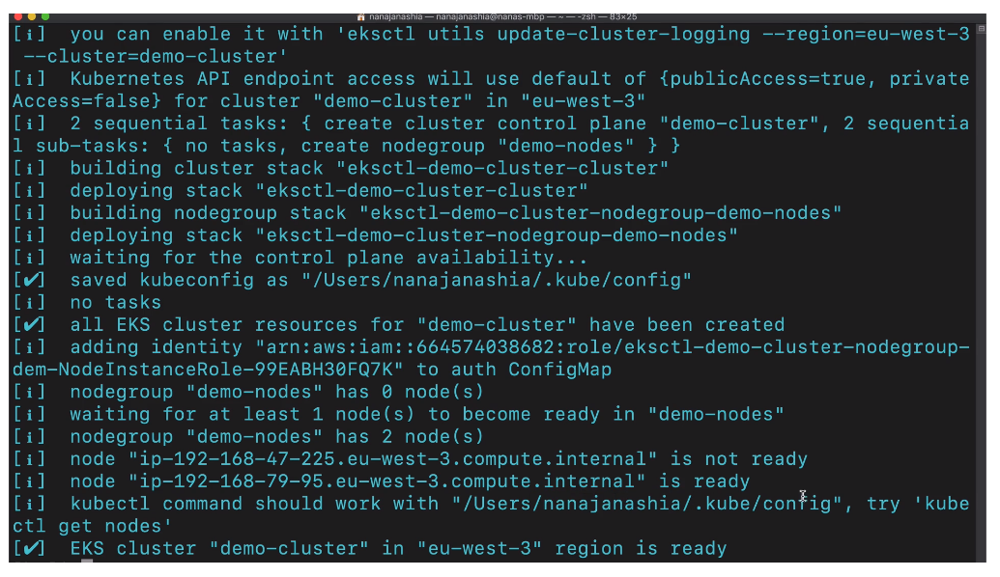

# Create EKS Cluster with `eksctl` Command Line Tool

Previously we created the EKS cluster and node groups **manually**. These steps
are time-consuming and difficult to replicate if you need the same cluster
environment multiple times.

One of the easiest ways to do this is using `ekstl` command line tool for
creating EKS clusters in AWS. Executes just one command and all the necessary
components get created and configured in the background. With cli options you
can customize your cluster.

## Creating a Cluster with `eksctl`

### Install `eksctl`

1. Follow installation instructions for your OS at
   (https://docs.aws.amazon.com/eks/latest/userguide/eksctl.html)[https://docs.aws.amazon.com/eks/latest/userguide/eksctl.html]

### Configure AWS credentials for `eksctl`

1. `aws configure list`: You should see the location of your aws config file
   (`~/.aws/config`) in the "Location" column. Configur credentials for your AWS
   user as necessary.

### Create EKS Cluster

1. `eksctl create cluster`: Creates cluster with default values

2. `eksctl create cluster \ --name demo-cluster \ --version 1.17 \ --region eu-west-3 \ --nodegroup-name demo-nodes \ --node-type t2.micro \ --nodes 2 \ --nodes-min 1 \ --nodes-max 3`

OR you can create a `.yaml` config file:

`cluster.yaml`:

```yaml
apiVersion: eksctl.io/v1alpha5
kind: ClusterConfig

metadata:
  name: demo-cluster
  region: eu-west-3

nodeGroups:
  - name: demo-nodes
    instanceType: t2.micro
    desiredCapacity: 2
    nodesMin: 1
    nodesMax: 3
```

and apply the file like so:

`eksctl create cluster -f cluster.yaml`

**See eksctl docs for file structure examples!**

### Review Created Cluster

The output from the `eksctl` tool should resemble this once cluster creation is
complete:



`kubectl get nodes` should display your nodes created in the correct region with
the specified version of K8s.

`eksctl` creates the necessary roles, VPCs, subnets, etc. in AWS.
