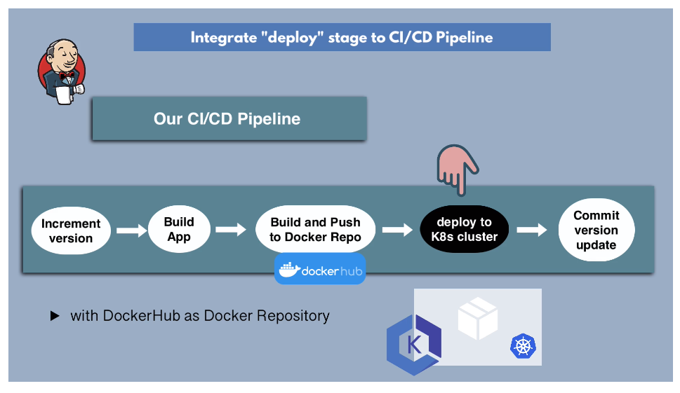

# Complete CI/CD Pipeline w/ Dockerhub



`Jenkinsfile`:

```groovy

   pipeline {

       agent any

       tools {
           maven "maven-3.8.4(default)"
       }

       stages {

           stage("increment version") {
               steps {
                   script {
                       echo "incrementing app version..."
                        sh 'mvn build-helper:parse-version versions:set \
                        -DnewVersion=\\\${parsedVersion.majorVersion}.\\\${parsedVersion.minorVersion}.\\\${parsedVersion.nextIncrementalVersion} \
                        versions:commit'

                        // Read the version number from pom.xml
                        def matcher = readFile('pom.xml') =~ '<version>(.+)</version>'
                        // Returns an array of matched tags and children tags inside
                        def version = matcher[0][1] // 0.0.0
                        env.IMAGE_NAME = "$version-$BUILD_NUMBER" // 0.0.0-{jenkins-build-number}
                   }
               }
           }

           stage("build app") {
               steps {
                   script {
                       echo "Building the app..."
                       sh "mvn clean package"
                   }
               }
           }

           stage("build image") {
               steps {
                   script {
                       echo "Building the Docker image..."
                       withCredentials([ credentialsId: '{credential-id-name}', passwordVariable: 'PWD', usernameVariable: 'USER']) {
                           sh 'docker build -t {artifact-repoaddr}:{artifact-repoport}/{image-name}:${IMAGE_VERSION} {dockerfile-location}'
                           sh "echo $PWD | docker login -u $USER --password-stdin {artifact-repoaddr}:{artifact-port}"
                           sh 'docker push {artifact-repoaddr}:{artifact-repoport}/{imagename}:${IMAGE_VERSION}'
                       }
                   }
               }
           }

           stage("deploy") {
                environment {
                    AWS_ACCESS_KEY_ID = credentials ("jenkins_aws_access_key_id")
                    AWS_SECRET_ACCESS_KEY= credentials  ("jenkins_aws_secret_access_key")
                }
                steps {
                    script {
                        echo "deploying docker image..."

                    }
                }
           }

           stage("commit version update") {
            steps {
                script {
                    withCredentials(usernamePassword(credentialsId: "gitlab-credentials", passwordVariable: "PWD", usernameVariable: "USER"))
                }
            }
           }
       }
   }

```
