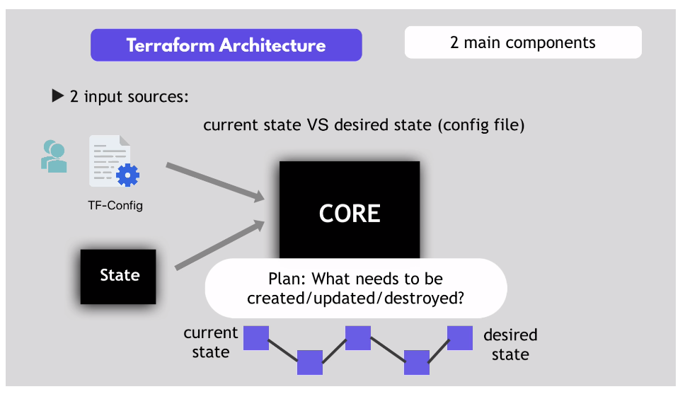

# Intro to Terraform

**Terraform** allows you to automate and manage your **infrastructure**,
platform, and services that run on your infrastructure. It is open source and
**declarative**.

Terraform **provisions infrastructure**.

## What is the Difference Between Ansible and Terraform?

Similarities:

1. Both IAC

Differences

1. Terraform is mainly **infra provisioning tool**:
   - relatively new
   - more advanced in orchestration
2. Ansible is mainly a **configuration tool**:
   - configure the infra once it's constructed
   - deploy apps
   - install/update software
   - more mature

**It's common to use BOTH tools for their own strong points!**

## Common Use Cases

- Managing existing infrastructure

- Replicating infrastructure in new environments (i.e. replicating the dev env
  in prod, etc.)

## Terraform Architecture

How Does Terraform Connect to Platform Provider?

2 main components:

1. Core: uses 2 input sources:

   - Terraform configuration: What to create/configure (execution plan)
   - State: state of current infrastructure

Terraform compares current state to desired end result, and updates current
state accordingly.



2. Providers: for specific technologies: AWS, Azure, K8s, IaaS, PaaS, SaaS etc.

- Create an AWS infra with K8s cluster, services inside etc.
- Over 100 providers give Terraform access to their resources


## Example Configuration File

```
# Configure the AWS Provider
provider "aws" {
    version = "~> 2.0"
    region = "us-east-1"
}

# Create a VPC
resource "aws_vpc" "example" {
    cidr_block = "10.0.0.0/16"
}
```

## How to Make Terraform Take Action?

Commands:

1. `refresh`: query infra provider to get current state
2. `plan`: create an execution plan to achieve desired state defined in
   configuration file
3. `apply`: execute the plan
4. `destroy`: destroy the resources/infrastructure in the proper order

## Key Takeaways

1. Terraform is a tool for creating, configuring, and managing infra
2. Terraform is a universal IaC tool for:
   - different cloud providers
   - different technologies
