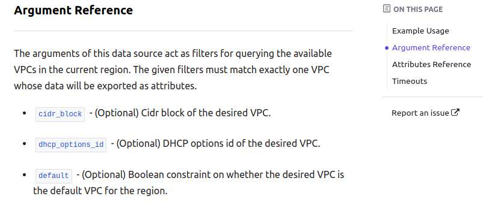

# Resources and Data Sources

## Creating Resources

In order to create a resource, we need the **resource name** (available in the
Terraform docs), and the necessary **attributes** also defined in the docs.

```
provider "aws" {
    region = "us-east-1"
    access_key = ""
    secret_key = ""
}

resource "{terraform resource name} {given-resource-name}
```

```
provider "aws" {
    region = "us-east-1"
    access_key = ""
    secret_key = ""
}

resource "aws_vpc" "development-vpc" {
    cidr_block = "10.0.0.0/16"
}

resource "aws_subnet" "dev-subnet-1" {
    vpc_id = aws_vpc.development-vpc.id # Reference the vpc id of the vpc to be created
    cidr_block = "10.0.10.0/24"
    availability_zone = "eu-west-3a"
}
```

## `terraform apply`

The `terraform apply` command applies the configuration defined in the config
file to create the specified resources.

From the terminal where your `terraform` directory is located:

- `terraform apply` > `yes`

## Data Sources

**Data Sources** allow data to be fetched for use in Terraform configuration. It
allows you to **query existing resources** in the cloud provider.

The **Argument Reference** section of the Terraform docs for the given resource
will tell you **what attributes** are available to set/change on the resource.
For example the
[docs for the `aws_vpc` provider's arguments](https://registry.terraform.io/providers/hashicorp/aws/latest/docs/data-sources/vpc#argument-reference)
contain the following information:



```
provider "aws" {
    region = "us-east-1"
    access_key = ""
    secret_key = ""
}

resource "aws_vpc" "development-vpc" {
    cidr_block = "10.0.0.0/16"
}

resource "aws_subnet" "dev-subnet-1" {
    vpc_id = aws_vpc.development-vpc.id # Reference the vpc id of the vpc to be created
    cidr_block = "10.0.10.0/24"
    availability_zone = "eu-west-3a"
}

# Use a data source to create resources in the
# default vpc
data "aws_vpc" "existing_vpc" {
    default = true
}

resource "aws_subnet" "dev-subnet-2" {
    vpc_id = data.aws_vpc.existing_vpc.id # add "data" prefix
    cidr_block = "172.31.48.0/20" # subset of IP addrs from DEFAULT vpc that are not already taken by EXISTING subnets in vpc
    availability_zone = "eu-west-3a"
}
```

- `terraform apply`

## Recap

`provider` is similar to **importing a library** in programming.

`resource/data` is similar to **calling a function of the library**.

`arguments` to the resource/data are similar to **parameters** of the function.

Terraform needs the provider **user credentials** to create resources.

Terraform is **declarative**, meaning that the configuration file **declares**
what resources should be created, but not **how** to create them.
