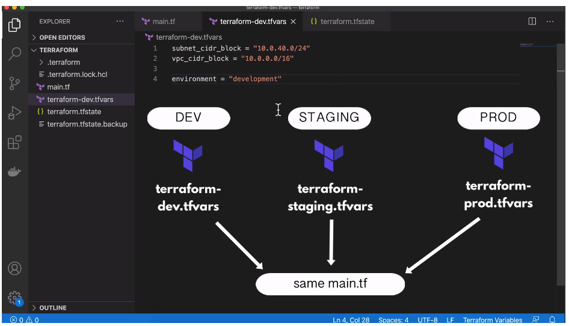

# Variables in Terraform

You can user variables as input values in Terraform. Input variables are like
functon arguments.

- Values used multiple times for different resources
- Re-use terraform files for multiple resources (e.g. `dev` and `prod`)

```
provider "aws" { region = "eu-west-3" access_key = "ACCESS_KEY_HERE" secret_key
= "SECRET_KEY_HERE" }

variable "subnet_cidr_block" { description = "subnet cidr block" }

variable "vpc_cidr_block" {
    description = "vpc cidr block"
}

resource "aws_vpc" "development-vpc" { cidr_block = var.vpc_cidr_block tags = { Name:
"development" } }

resource "aws_subnet" "dev-subnet-1" { vpc_id = aws_vpc.development-vpc.id
cidr_block = var.subnet_cidr_block availability_zone = "eu-west-3a" tags = {
Name: "subnet-1-dev" } }

```

- `terraform apply`: Enter a value for your variable at the prompt.

- `terraform apply -var "subnet_cidr_block=10.0.30.0/24"` Enter a value for the
  variable using the `var` command line flag (avoid input prompt).

  ## Best Practice: Use a Variables File

  `terraform.tfvars`:

  ```
  subnet_cidr_block = "10.0.30.0/24"

  ```

  - `terraform apply`: Terraform will automatically find the `.tfvars` file and
    apply the variables in the `.tf` file

## Use Case for Input Variables

1. Replicate same infrastructure for different environments, and change
   parameters depending on the environment.



If you change the variables file name to something other than
`terraform.tfvars`, you must pass the vars file name:

- `terraform apply -var-file {var-file-name}`

## Default Values

We can assign variables **default values**:

```

//...

variable "subnet_cidr_block" { description = "subnet cidr block" default = "10.0.10.0/24" }

```

The default value will apply if Terraform cannot find a value for that variable,
either in a vars file or from the command line.

## Type Constraints

You can set **type constraints** on variables as well:

`main.tf`:

```
//...

variable "cidr_blocks" { description = "cidr blocks for vpc and subnets" type = list(string) }

resource "aws_vpc" "development-vpc" {
    cidr_block = var.cidr_blocks[0]
    tags = {
        Name: "development"
    }
}

resource "aws_subnet" "dev-subnet-1" { vpc_id = aws_vpc.development-vpc.id
cidr_block = var.cidr_blocks[1] availability_zone = "eu-west-3a" tags = {
Name: "subnet-1-dev" } }

```

`terraform-dev.tfvars`:

```
cidr_blocks = ["10.0.0.0/16", "10.0.50.0/24"]

```

- `terraform apply -var-file terraform-dev.tfvars`

### Objects as Variables

You can also use **objects** as variables in Terraform:

`terraform-dev.tfvars`:

```
cidr_blocks = [{cidr_block: "10.0.0.0/16", name: "dev-vpc"}, {cider_block = "10.0.50.0/24", name = "dev-subnet" }]

```

`main.tf`:

```
//...

variable "cidr_blocks" { description = "cidr blocks for vpc and subnets" type = list(object(
    {
        cidr_block = string
        name = string
    }
)) }

resource "aws_vpc" "development-vpc" {
    cidr_block = var.cidr_blocks[0].cidr_block
    tags = {
        Name: var.cidr_blocks[0].name
    }
}

resource "aws_subnet" "dev-subnet-1" { vpc_id = aws_vpc.development-vpc.id
cidr_block = var.cidr_blocks[1].cidr_block availability_zone = "eu-west-3a" tags = {
Name: var.cidr_blocks[1].name } }

```
