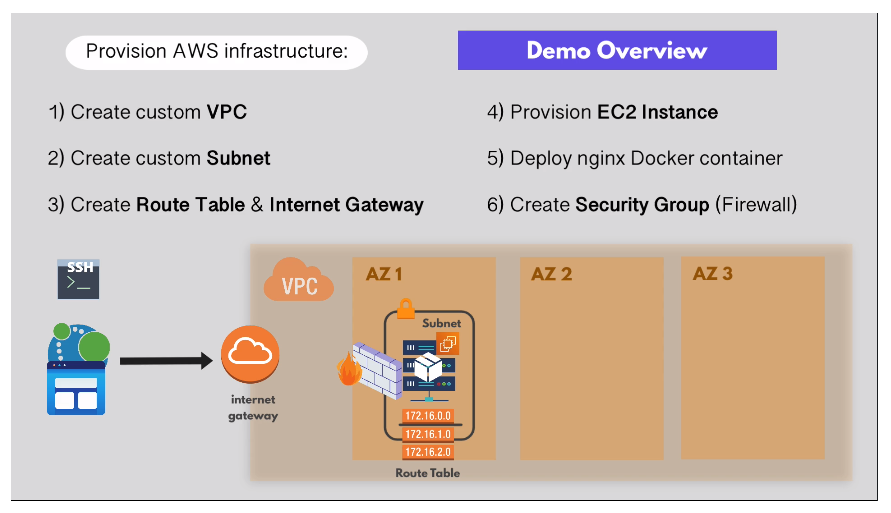
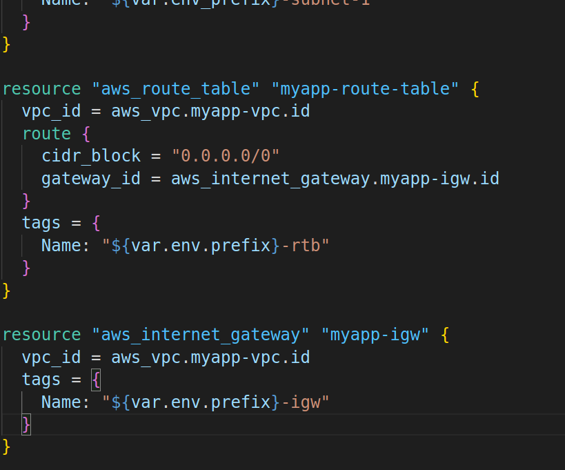

# Demo Project 1 Part 1: Automate AWS Infrastructure

## Demo Overview

**Objective**: Deploy an EC2 instance on AWS and run simple Docker container.

To do so, we need to **provision the infrastructure** on AWS platform. We'll do
so with Terraform:

1. Create custom VPC
2. Create custom Subnet in one AZ
3. Connect VPC to internet by creating Route Table and Internet Gateway
4. Provision EC2 instance
5. Deploy nginx Docker container
6. Create Security Group (Firewall): Internet traffic and SSH



**Best practice** with Terraform is to create infrastructure from scratch, and
leave defaults created by AWS (or other cloud provider) as-is.

## Provision Infrastructure

1. See `12-demo-files` for required changes to `.main.tf` and
   `terraform.tfvars`.

2. `terraform plan`: View the execution plan before provisioning.

3. `terraform apply --auto-approve`: Provision the infrastructure. Verify that
   VPC and subnets have been created in AWS management console.

4. View created components:
   - **Route Table** for your VPC: A "virtual router" in your private VPC.
     Decides where traffic will be forwarded within your new VPC.
   - **Network Access Control List (ACL)**: Firewall config for VPC that applies
     to **subnets** within the VPC (security groups apply to **servers**). NACLs
     are OPEN by default, Security Groups are CLOSED by default.
5. Create a **Route Table** and an **Internet Gateway** to handle traffic
   to/from the **public internet** (i.e. OUTSIDE of your VPC). Note that
   Terraform is smart enough to create the components in the correct order
   regardless of the order in which they're defined in the `main.tf` file:

   `main.tf`: 

   - `terraform plan`: View resources to be created
   - `terraform apply --auto-approve`: Create resources in AWS.

## Associate Subnet with Route Table

We have created a route table inside our VPC, but we need to associate our
subnets with the correct route table in order to allow the route table to
forward traffic within the subnet. By default, subnets are automatically
associated with the **Main** route table ("Main" = "Yes" in the Route Tables
list in AWS console). However the main route table is in the **default** VPC,
not our newly-created custom VPC!

1. Add the following in `main.tf`:

```
resource "aws_route_table_association" "a-rtb-subnet" {
  subnet_id = aws_subnet.myapp-subnet-1.id
  route_table_id = aws_route_table.myapp-rout-table.id
}
```

2. `terraform apply --auto-approve`

### Using the Default Route Table

It is also possible to associate the subnet with the default route table:

- `terraform state show aws_vpc.myapp-vpc`: Show existing resources. Get the
  `default_route_table_id` attribute name
  (`aws_vpc.myapp-vpc.default_route_table_id`).

- make the following changes in `main.tf` Remove config for the association w
  the custom VPC (if necessary):

```
resource "aws_default_route_table" "main-rtb" {
default_route_table_id = aws_vpc.myapp-vpc.default_route_table_id }
```

- `terraform plan` > `terraform apply --auto-approve`

Note that you will not see any explicit subnet associations in the AWS console,
but they are by default associated with the default route table.

## Security Group

This configures firewall rules for your EC2 instances in the created subnets
(port 22 for SSH, port 8080 to access from web browser in this case).

Add the following to `main.tf`:

```
resource "aws_security_group" "myapp-sg" {
  name = "myapp-sg"
  vpc_id = aws_vpc.myapp-vpc.id
  ingress {
    from_port = 22 # can configure a range of ports in sec group
    to_port = 22
    protocol = "tcp"
    cidr_blocks = [var.my_ip] # Define a list of IP addrs; save in .tfvars file (and do not check in to SCM)
  }
  ingress {
    from_port = 8080
    to_port = 8080
    protocol = "tcp"
    cidr_blocks = ["0.0.0.0/0"]
  }

  egress { # allow any traffic to LEAVE the vpc
    from_port = 0
    to_port = 0
    protocol = "-1"
    cidr_blocks = ["0.0.0.0/0"]
    prefix_list_ids = []
  }

  tags = {
    Name: "${var.env_prefix}-sg"
  }
}
```

- `terraform plan` > `terraform apply --auto-approve`

### Use Default Security Group

`main.tf`:

```
resource "aws_default_security_group" "default-sg" {
    # same configuration as above...

    tags = {
    Name: "${var.env_prefix}-defaul-sg"
  }
}
```

- `terraform plan` > `terraform apply --auto-approve`
