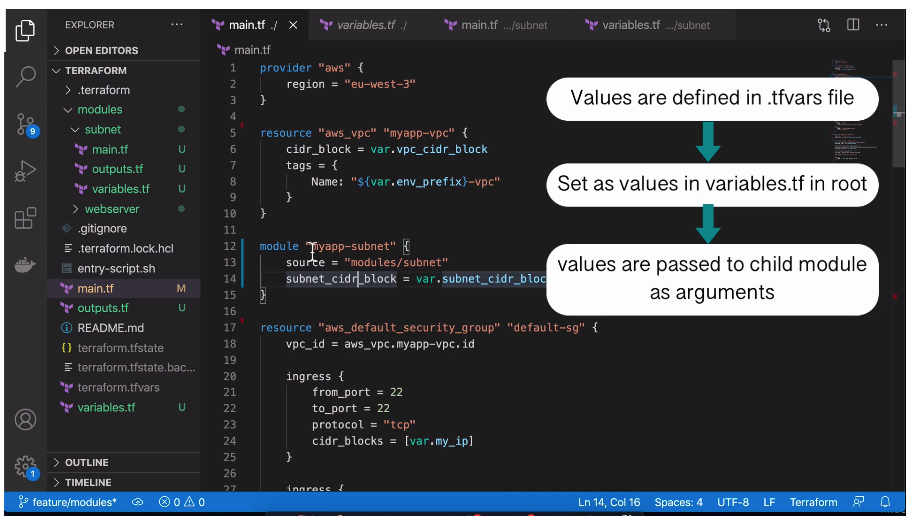

# Modules in Terraform Pt.3: Modularize our Project

## Refactoring the Project Structure

It's common to organize Terraform projects according to the following structure:

```
|- ./
|- ./main.tf
|- ./variables.tf
|- ./outputs.tf
|- ./providers.tf

```

Move the `providers`, `output`s, and variable definitions to the respective
files from the `main.tf` file. Terraform is smart enough to know the locations
and import the values as needed without explicit `import` statements. Note that
the file names are **arbitrary**, but defined as above according to convention.

## Create a Module

Add the following structure to your project:

```
|- ./
|- ./main.tf
|- ./variables.tf
|- ./outputs.tf
|- ./providers.tf
|- ./modules
|---- /subnet
|------ /main.tf
|------ /outputs.tf
|------ /variables.tf
|---- /webserver
|------ /main.tf
|------ /outputs.tf
|------ /variables.tf

```

Modules **should group resources into a logical unit**, to make a group of
resources reusable.

### Variables



### Accessing the Resources of a Child Module

Currently, the root `main.tf` file contains references to the subnets that are
now being created inside the `modules/subnet` module:

`./main.tf`

```
# ...

resource "aws_instance" "myapp-server-1" {
    ami = data.aws_ami.latest-amazon-linux-image.id
    instance_type = var.instance_type
    subnet_id = aws_subnet.my-app-subnet-1.id
    vpc_security_group_ids = [aws_security_group.my-app-sec-group.id]
    associate_public_ip_address = true
    availability_zone = var.avail_zone[0]
    key_name = "aws-ssh-key"
    tags = {
        Name = "myapp-server-1"
    }
}

# ...
```

These references are now **broken**. We need to fix them in order to point to
the modularized resources in `modules/subnet`.

How can we access the resources of a module **inside another module**?

We can **output** values from the **module** in order to **expose/export
resource attributes** to the parent module.

### Re-initialize Terraform After Module Changes

After making changes to the module(s), you must run `terraform init` again.
