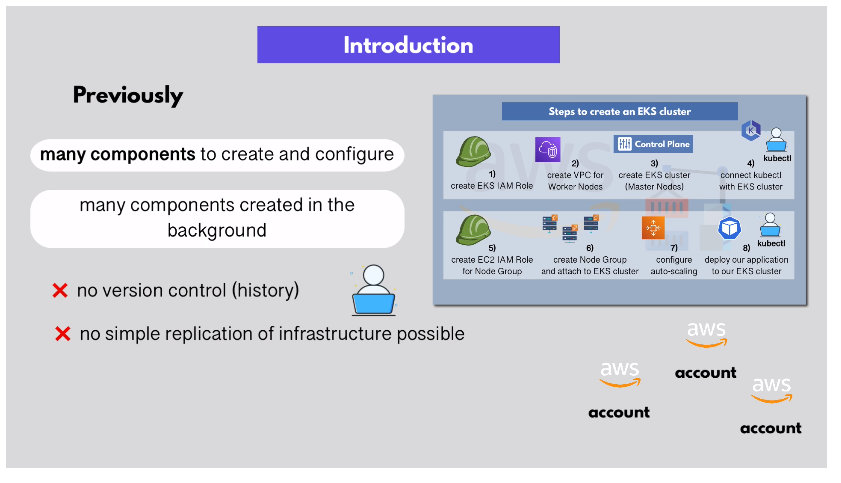
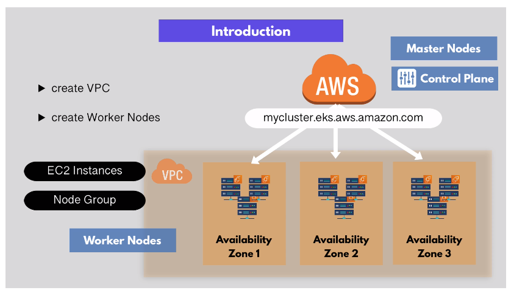

# Automate Provisioning EKS Cluster with Terraform: Part 1

Previously we created an EKS cluster **manually**. This method works, but it has
some issues:

- Many components to crate and configure
- Many components created in the background
- No version control history
- No simple replication of infrastructure possible (if you wanted to replicate
  this setup in another VPC, for example)
- Difficult to delete/clean up



It makes sense to **automate** this process with Terraform!

## EKS Component Refresher



- Clusters are always created in a specific region with multiple AZs
- Worker nodes should be deployed in multiple AZs in a specific region for high
  availability

## Provision EKS Cluster

`vpc.tf`:

```
module "myapp-vpc" {
    source = "terraform-aws-modules/vpc/aws
    version = "2.64.0"

    name = "myapp-vpc"
    cidr = var.vpc_cidr_block

}
```
