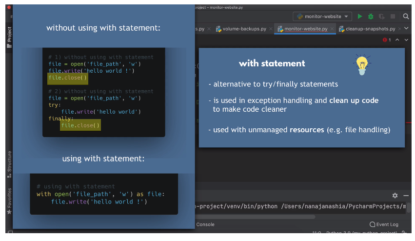

# Website Monitoring 2: Automated Email Notification

We want to send an email when the server is unavailable. How do we send email in
Python?

We will need to give permission and credentials to allow Python to connect to
the sending email account.

## Use `smtplib` to Send Email

`monitor-website.py`

```python
import requests
import smtplib
import os

EMAIL_ADDR = os.environ.get('SMTP_ADDR')
EMAIL_PASS = os.environ.get('SMTP_PASS')

response = requests.get('http://{server-ip}:8080')

print(response)
if response.status_code == 200:
    print('Application is running successfully')
else:
    print('Application down. Fix it')
    # send email to me
    with smtplib.SMTP('smtp.gmail.com', 587) as smtp:
        smtp.starttls() # establish secure connection with gmail server
        smtp.ehlo() # identifies python with mail server

        # Without 2-factor authentication
        # smtp.login("user.one@gmail.com", "password")

        # With 2-FA
        # smtp.login("user.one@gmail.com", "my-app-password-here")

        # Use env vars
        smtp.login(EMAIL_ADDR, EMAIL_PASS)

        # send email
        smtp.sendmail(EMAIL_ADDR, EMAIL_ADDR, "Subject: SITE DOWN\n Fix the issue")

```

**Note**: The `with` statement is special Python syntax for exception handling,
used to clean up unmanaged resources:



If authenticating **without 2-FA**, you must enable the **Less Secure Apps
Access** setting in Gmail in order to allow your Python program to authenticate
with user/password credentials.

If authenticating **with 2-FA**, you must generate an App Password in the **App
Passwords** setting. Copy the generated password to allow other programs to
connect to your Gmail account.

**Best practice** is to set the user/password credentials as **environment
variables**.

## Handle Connection Errors

Use `try-except` to handle errors, such as errors connecting to the application
server. Send an email to the responsible party/team:

`monitor-website.py`

```python
import requests
import smtplib
import os

EMAIL_ADDR = os.environ.get('SMTP_ADDR')
EMAIL_PASS = os.environ.get('SMTP_PASS')

def send_notification(msg):
    with smtplib.SMTP('smtp.gmail.com', 587) as smtp:
        smtp.starttls()
        smtp.login(EMAIL_ADDR, EMAIL_PASS)
        smtp.sendmail(EMAIL_ADDR, EMAIL_ADDR, msg)

try:
    response = requests.get('http://{server-ip}:8080')

    print(response)
    if response.status_code == 200:
        print('Application is running successfully')
    else:
        print('Application down. Fix it')
        # send email to me
        send_notification("Subject: SITE DOWN\n Fix the issue")
except Exception as ex:
    print(f"Connection error happened: {ex}")
    send_notification("Subject: SITE DOWN\n Application not accessible")

```
