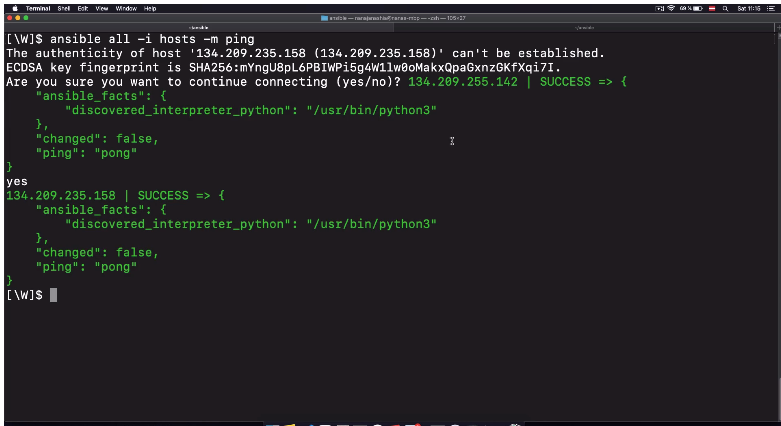

# Setup Managed Server

## Connecting Ansible to Remote Servers

For Linux servers, Python must be installed on the server.

Once Python 3 is installed, SSH into the server instance and run (as root user)
and connect Ansible to remote server(s):

- Create `hosts` file (Ansible Inventory file) with the IP addresses of all the
  servers you wish to connect to:

`hosts`:

```
134.209.255.142 ansible_ssh_private_key_file={private_key_file_location} ansible_user=root
134.209.235.158 ansible_ssh_private_key_file={private_key_file_location} ansible_user=root
```

- `ansible all -i hosts -m ping`: Test the ansible connection



### Grouping Servers

You can put each server in more than one group. You can create groups that
track:

- **WHERE**: a data center/region
- **WHAT**: e.g. a database servers, web servers etc.
- **WHEN**: which stage, e.g. dev, test, prod environment

Use the **square bracket syntax** to give the droplets a group name:

`hosts`:

```
[digital ocean droplet]
134.209.255.142 ansible_ssh_private_key_file={private_key_file_location} ansible_user=root
134.209.235.158 ansible_ssh_private_key_file={private_key_file_location} ansible_user=root

[aws]
# ...
```

Execute Ansible command to target only droplets:

- `ansible droplet -i hosts -m ping`

Execute on one **specific server** in the group:

- `ansible {ip-addr} -i hosts -m ping`

#### Configure a Group of Servers

`hosts`:

```
[droplet]
134.209.255.142
134.209.235.158

[droplet:vars]
ansible_ssh_private_key_file={ssh-private-key-location}
ansible_user=root
```
