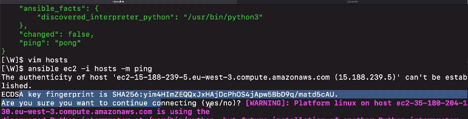

# Managing Host Key Checking

Host key checking is enabled by default in Ansible. It guards against server
spoofing and main in the middle attacks:



If we want to fully automate, we need to remove this interactive terminal
message!

## Authorized Keys and Known Hosts

2 options based on:

- "long-lived" servers
- ephemeral or temporary servers

The `~/.ssh/known_hosts` file contains a list of all the servers you've ever
SSH-d into.

You can **add an entry** into the know hosts file with the following commands:

- `ssh-keyscan -H {new-host-ip} >> ~/.ssh/known_hosts`: Add new host to known
  hosts

- `ssh-copy-id root@{remote-host-ip}`: Store connecting machine's public SSH key
  on remote server (if you did NOT specify key upon creating the server)

### Disable Host Key Checking

**Less secure**, but useful if you have infrastructure where servers are
dynamically created and destroyed often.

Disable key checks in Ansible configuration file in the default location:

- `/etc/ansible/ansible.cfg` OR
- `~/.ansible.cfg`

- `vim ~/.ansible.cfg`

```
[defaults]
host_key_checking = False
```
