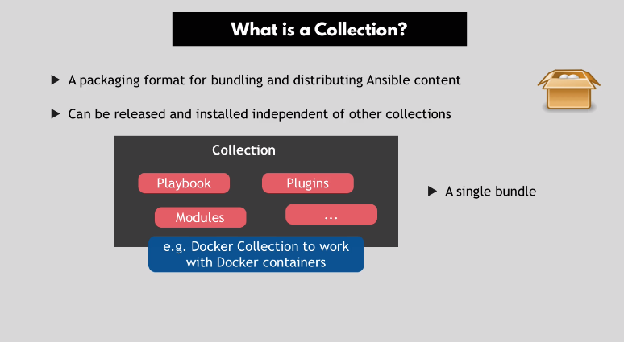

# Collections in Ansible

A **Collection** is a packaging format for bundling and distributing Ansible
content. It can be released and installed indpendently of other collections.

All versions of Ansible >= 2.10 use **collections**. All modules in Ansible have
now been grouped together into collections. For example, the `apt` and `service`
module are now part of the `ansible.builtin` collection.

[See here for the index of available Collections in the Ansible documentation](https://docs.ansible.com/ansible/latest/collections/).

## Plugins

**Plugins** are pieces of code that add to Ansible's functionality, or it's
modules.



## Ansible Galaxy

An online hub for finding and publishing collections. Ansible Galaxy is like an
artifact repository for Ansible collections.

It is also a command line tool to install individual collections. It comes
installed with Ansible itself. It allows you to **fetch** collections and
**install them**. If a particular collection is **updated**, you can update it
using `ansible-galaxy collection install {collection-name}`:

- `ansible-galaxy collection install amazon.aws`: Updates the `amazon-aws`
  collection

- `ansible-galaxy collection list`: List the available collections on your
  machine and their installation location.

### Creating Your own Collection

You can create your own Ansible collections as well. Ansible collections follow
a simple data structure:

```
collection/
|--docs/
|--galaxy.yml
|--meta/
|----/runtime.yml
|--plugins/
|----/modules
|------module1.py
|--README.md
|--roles/
|----role1/
|----role2/
|--playbooks/
|----files/
|----vars/
|----templates/
|----tasks/
|--tests/
```
