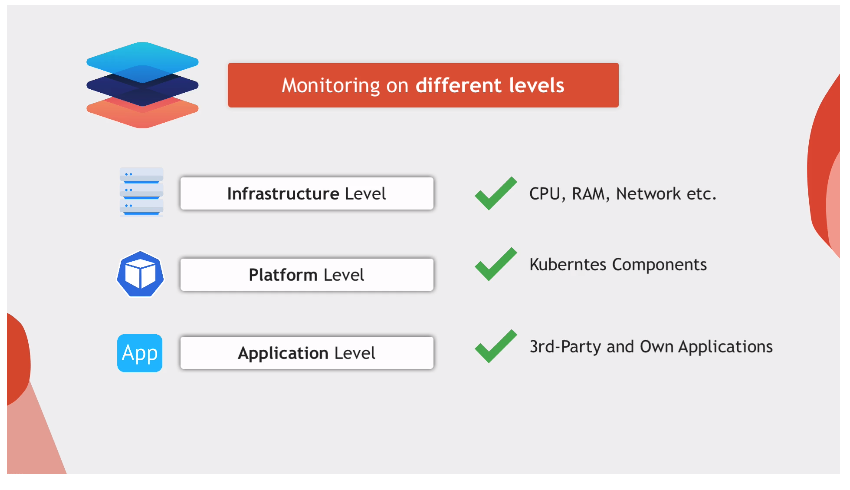

# Module Intro

In this module, we will learn to monitor a K8s cluster running a microservices
app using **Prometheus**.

## Demo Overview

1. Create a K8s cluster with EKS
2. Deploy ms app
3. Deploy Prometheus monitoring stack
4. Monitor:
   - Cluster nodes
   - K8s components (workloads, pods, deployments, etc.)
   - Monitor applications running in pods (e.g. Redis)
5. Deploy Redis Exporter
6. Monitor our **own applications** using custom libraries for multiple
   programming languags

### Data Visualization

We will use the Prometheus UI as well as **Grafana**, a data viz tool. We will
configure it to **notify us** when things go wrong in our cluster using
Prometheus **alert rules**.
