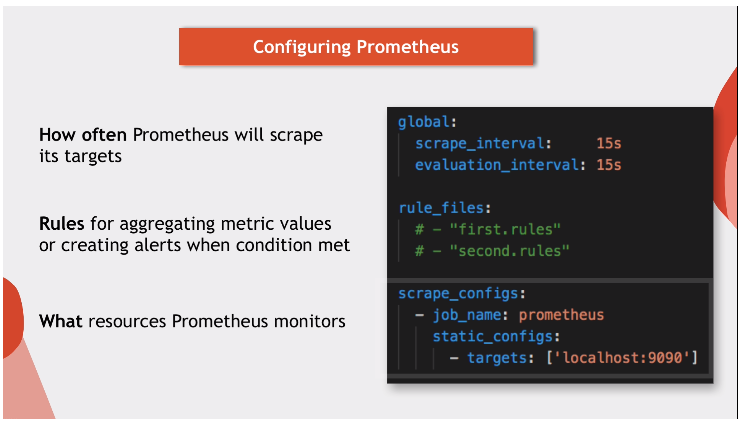

# Intro to Monitoring with Prometheus

## What is Prometheus?

**Prometheus** was created to monitor container environments such as K8s,
docker-swarm, etc.

## Where and Why is Prometheus Used?

Typically a devops environment may have multiple servers distributed over many
locations, running 100s, 1000s of containers. Any one of them can crash and
cause failure of others. How do we quickly identify what went wrong, and where?

A tool that constantly monitors all the services and alerts sys admins when
crashes happen, **or identifies problems _before_ they occur and sends alerts to
sys admins** helps us avoid such problems!

## Prometheus Architecture

### Prometheus Server

**Prometheus Server** monitors a particular **target**: Linux/Windows servers,
databases, application, etc. It monitors metrics of that target such as:

- CPU status
- memory/disk space usage
- Exceptions count
- Requests count
- Request duration etc.

Prometheus saves these **metrics** as follows:

Prometheus **pulls** metrics from HTTP endpoints. By default this endpoint is
`{host-address}/metrics`. In order for this to work, the target must **expose**
the `/metrics` endpoint, and publish the metrics in the **correct format**.

Some services need an `Exporter` component that fetches metrics from the target,
and converts the metrics to a format Prometheus can understand. For example, if
you want to monitor a Linux server you can download a `node Exporter`, untar and
execute it on your server. It will convert the metrics of the server and expose
the `/metrics` endpoint. You can then configure Pro to scrape that endpoint.
Exporters are also available as Docker images.

## Monitoring your Own Applications

Prometheus **client libraries** for various programming languages (Node, Java,
etc.) allow you to expose a `/metrics` endpoint to which your application can
emit relevant metrics to be monitored.

## Pull System for Metrics

Unlike **push system** monitoring services that create a high network traffic
load from constant push requests from all services, Prometheus instances can
**pull** metrics:

- Reduces network trafic
- Better detection/insight if service is up and running

## Configuring Prometheus

How does Prometheus know what to scrape and when?

You can configure **which targets** Prometheus should scrape, and **at what
interval**, in the `prometheus.yaml` file:

### Alert Manager

How does Prometheus trigger the alerts, and who receives them?

`AlertManager` reads the rules defined in the config file, and if the rule
condition is met an alert gets fired

### Data Storage

Where does Prometheus store its metrics data? How can other systems access it?

Prometheus stores data on a local disk but also optionally on remote storage
systems. Once the metrics have been collected you can query it using PromQL
query language, or use data viz tools like Grafana.

## Prometheus, Docker, and K8s

Prometheus is fully compatible with Docker and K8s. Can easily be deployed
